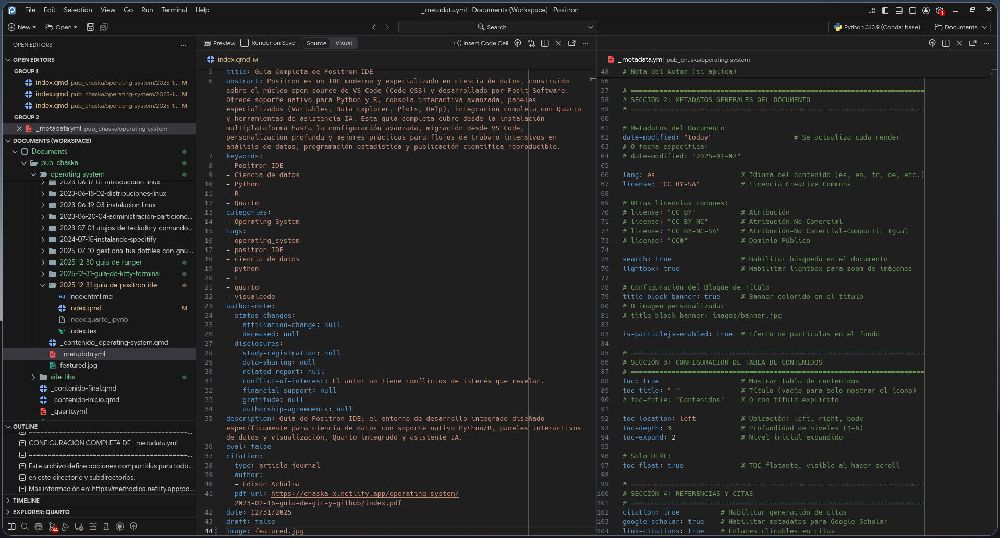

**¿Qué es Positron?**

Positron es un IDE moderno y extensible para ciencia de datos construido sobre **Code OSS** (el núcleo open-source de VS Code). Desarrollado por **Posit Software** (anteriormente RStudio), está diseñado específicamente para flujos de trabajo de ciencia de datos.

**Características Principales:**

- **Basado en Code OSS**: Toda la potencia de VS Code
- **Soporte nativo Python y R**: Sin necesidad de extensiones externas
- **Console interactiva**: IPython/IRKernel integrada
- **Data Explorer**: Visualización de dataframes en vivo
- **Variables Pane**: Inspección de variables
- **Plots Pane**: Visualización de gráficos
- **Help Pane**: Documentación integrada
- **Connections Pane**: Gestión de bases de datos
- **Quarto integrado**: Documentos dinámicos
- **AI Assistant**: Positron Assistant y Databot
- **Open VSX**: Marketplace de extensiones open-source

**Positron vs VS Code vs RStudio**

| Característica                  | Positron                  | VS Code                   | RStudio                   |
|---------------------------------|---------------------------|---------------------------|---------------------------|
| Base técnica                    | Code OSS                  | Propietario + Code OSS    | Propietario (Posit)       |
| Soporte nativo Python           | Sí                        | No (extensión)            | Limitado                  |
| Soporte nativo R                | Sí                        | No (extensión)            | Sí (muy optimizado)       |
| Consola interactiva             | Sí                        | No                        | Sí                        |
| Panel de datos/variables/plots  | Sí                        | No                        | Sí                        |
| Soporte Quarto                  | Sí (nativo)               | Sí (extensión)            | Sí                        |
| Extensiones                     | Open VSX                  | VS Marketplace            | Limitadas                 |
| Asistente IA integrado          | Sí                        | No (requiere Copilot)     | No                        |
| Multilenguaje                   | Sí (R + Python)           | Sí (muy amplio)           | Limitado (foco en R)      |
| Estabilidad                     | Alta                      | Muy alta                  | Muy alta                  |
| Crashes afectan el IDE          | No                        | No                        | Sí                        |


- **Positron** se posiciona como el sucesor natural para flujos de trabajo modernos de ciencia de datos que usan **R y Python** por igual. Combina lo mejor de RStudio (consola interactiva, panes de datos/plots/variables) con la extensibilidad y modernidad de VS Code.
- **VS Code** sigue siendo el rey de la versatilidad general, pero requiere mucha configuración para obtener una experiencia fluida en R o Python data science.
- **RStudio** permanece muy bien mantenido por Posit, con optimizaciones específicas para R que aún no están al 100% en Positron (ej. algunos add-ins, soporte completo de .Rproj en ciertos casos, o features muy nicho como Sweave o ciertos publishing tools). Si tu trabajo es 95–100% R y no necesitas Python, RStudio sigue siendo excelente y estable.


# Instalación

## Requisitos del Sistema

**Mínimos:**

- Sistema Operativo: Linux, macOS, Windows
- Espacio en disco: 500 MB
- RAM: 2 GB (4 GB recomendado)

## Linux (Ubuntu/Debian)

```bash
# Descargar desde el sitio oficial
# https://github.com/posit-dev/positron/releases

# O instalar desde .deb
sudo dpkg -i positron_*.deb
sudo apt-get install -f  # Instalar dependencias
```

## macOS

```bash
# Descargar .dmg desde:
# https://github.com/posit-dev/positron/releases

# O con Homebrew
brew install --cask positron
```

## Windows

```bash
# Descargar instalador desde:
# https://github.com/posit-dev/positron/releases

# Ejecutar positron-setup.exe
```

## Verificar Instalación

```bash
# Abrir Positron
positron

# O desde línea de comandos
positron --version
```

## Configurar Comando en Terminal

**Linux/macOS:**

```bash
# Añadir a ~/.bashrc o ~/.zshrc
export PATH="$PATH:/path/to/positron/bin"

# O crear symlink
sudo ln -s /path/to/positron/bin/positron /usr/local/bin/positron
```

# Migración desde VS Code

## Importar Configuración

**Automáticamente al primer inicio:**

1. Positron te preguntará si quieres importar settings de VS Code
2. Click en "Yes" para importar
3. Revisa los settings importados
4. Guarda los cambios

**Manualmente:**

```
Command Palette (Ctrl+Shift+P) → Preferences: Import Settings...
```

## Diferencias Clave

**Extensiones:**

- Positron usa **Open VSX** en lugar de VS Marketplace
- Algunas extensiones pueden no estar disponibles
- Python y R son nativos (no necesitas ms-python.python)

**Features Nuevas:**

- **Console**: Reemplaza el terminal para código interactivo
- **Variables Pane**: Inspección de datos en vivo
- **Data Explorer**: Visualización de dataframes
- **Plots Pane**: Gráficos integrados
- **Help Pane**: Documentación contextual

## Extensiones a Reemplazar

| VS Code | Positron |
|---------|----------|
| ms-python.python | Built-in (nativo) |
| REditorSupport.r | Built-in (posit.air-vscode) |
| Jupyter | Built-in |
| GitLens | Instalar desde Open VSX |
| Prettier | Instalar desde Open VSX |


# Configuración Inicial

## Ubicación de Archivos

```
Linux: ~/.config/Positron/User/settings.json
macOS: ~/Library/Application Support/Positron/User/settings.json
Windows: %APPDATA%\Positron\User\settings.json
```

## Abrir Settings

**GUI:**

```
File → Preferences → Settings (Ctrl+,)
```

**JSON:**

```
Command Palette → Preferences: Open User Settings (JSON)
```

## Configuración Básica Recomendada

```json
{
    // Editor
    "editor.fontSize": 14,
    "editor.fontFamily": "'JetBrains Mono', 'Fira Code', 'Hack Nerd Font', monospace",
    "editor.fontLigatures": true,
    "editor.lineNumbers": "on",
    "editor.minimap.enabled": false,
    "editor.formatOnSave": true,
    "editor.formatOnPaste": true,
    "editor.cursorBlinking": "smooth",
    "editor.cursorSmoothCaretAnimation": "on",
    
    // Tema
    "workbench.colorTheme": "Default Positron Dark",
    "workbench.iconTheme": "material-icon-theme",
    
    // Terminal
    "terminal.integrated.fontFamily": "'Hack Nerd Font', monospace",
    "terminal.integrated.fontSize": 13,
    "terminal.integrated.defaultProfile.linux": "bash",
    "terminal.integrated.copyOnSelection": true,
    "terminal.integrated.cursorBlinking": true,
    "terminal.integrated.inheritEnv": false,
    
    // Git
    "git.enableSmartCommit": true,
    "git.autofetch": true,
    "git.confirmSync": false,
    
    // Files
    "files.autoSave": "onFocusChange",
    "files.associations": {
        "*.qmd": "quarto",
        "*.Rmd": "rmarkdown",
        "renv.lock": "json"
    },
    
    // Quarto
    "quarto.visualEditor.spellingDictionary": "es_ES",
    
    // Positron-specific
    "positron.assistant.enable": true,
    "positron.assistant.showTokenUsage.enable": true
}
```

# Interfaz de Usuario

## Layout Principal

```
┌─────────────────────────────────────────────────────┐
│ Title Bar                                           │
├──────────────────┬──────────────────────────────────┤
│                  │                                  │
│  Activity Bar    │                                  │
│  (left/bottom)   │       Editor Area                │
│                  │                                  │
│  - Explorer      │                                  │
│  - Search        ├──────────────────────────────────┤
│  - Source Ctrl   │                                  │
│  - Run/Debug     │       Console / Terminal         │
│  - Extensions    │                                  │
│                  │                                  │
├──────────────────┴──────────────────────────────────┤
│  Status Bar                                         │
└─────────────────────────────────────────────────────┘
```

## Panes Exclusivos de Positron

**Variables Pane:**

```
Muestra todas las variables en el entorno actual
- Nombre
- Tipo
- Valor/Tamaño
- Preview
```

**Data Explorer:**

```
Visualización interactiva de dataframes
- Filtrado
- Ordenamiento
- Búsqueda
- Exportación
```

**Plots Pane:**

```
Visualización de gráficos generados
- Historial de plots
- Zoom
- Exportar
```

**Help Pane:**

```
Documentación contextual
- Búsqueda integrada
- Ejemplos
- Argumentos de funciones
```

**Console:**

```
Shell interactivo para Python/R
- Completado de código
- Syntax highlighting
- Integración con Variables/Plots
```

## Personalizar Layout

**Activity Bar Position:**

```json
"workbench.activityBar.location": "bottom" // o "top", "left"
```

**Side Bar Position:**

```json
"workbench.sideBar.location": "right" // o "left"
```

**Command Palette Position:**

```
Arrastrarlo a la posición deseada
```

# Atajos de Teclado

## Atajos Específicos de Positron

| Atajo | Acción |
|-------|--------|
| `Ctrl+Enter` | Ejecutar línea/selección en Console |
| `Ctrl+Alt+Home` | Ejecutar desde inicio hasta línea actual |
| `Ctrl+Alt+End` | Ejecutar desde línea actual hasta fin |
| `Ctrl+Shift+0` | Reiniciar intérprete |
| `Ctrl+Shift+P` | Ejecutar archivo completo en Console |
| `F1` | Ayuda contextual |
| `Ctrl+K, Ctrl+R` | Ayuda contextual (alternativo) |
| `Ctrl+K, F` | Enfocar Console |
| `Ctrl+K, V` | Enfocar Variables pane |
| `Ctrl+L` | Limpiar Console |

## Atajos Generales (heredados de VS Code)

**Editor:**

| Atajo | Acción |
|-------|--------|
| `Ctrl+P` | Quick Open (buscar archivo) |
| `Ctrl+Shift+P` | Command Palette |
| `Ctrl+,` | Settings |
| `Ctrl+B` | Toggle Sidebar |
| `Ctrl+J` | Toggle Panel |
| `Ctrl+Shift+E` | Explorer |
| `Ctrl+Shift+F` | Search |
| `Ctrl+Shift+G` | Source Control |
| `Ctrl+Shift+D` | Run & Debug |
| `Ctrl+Shift+X` | Extensions |

**Edición:**

| Atajo | Acción |
|-------|--------|
| `Ctrl+Space` | Trigger suggestions |
| `Ctrl+Shift+K` | Delete line |
| `Alt+Up/Down` | Move line up/down |
| `Shift+Alt+Up/Down` | Copy line up/down |
| `Ctrl+/` | Toggle comment |
| `Ctrl+Shift+[` | Fold region |
| `Ctrl+Shift+]` | Unfold region |
| `Ctrl+K Ctrl+0` | Fold all |
| `Ctrl+K Ctrl+J` | Unfold all |

**Navegación:**

| Atajo | Acción |
|-------|--------|
| `Ctrl+G` | Go to line |
| `Ctrl+Shift+O` | Go to symbol |
| `Ctrl+T` | Show all symbols |
| `F12` | Go to definition |
| `Alt+F12` | Peek definition |
| `Shift+F12` | Show references |
| `Ctrl+K F12` | Open definition to side |

**Terminal:**

| Atajo | Acción |
|-------|--------|
| `` Ctrl+` `` | Toggle terminal |
| `` Ctrl+Shift+` `` | New terminal |
| `Ctrl+Shift+C` | Copy |
| `Ctrl+Shift+V` | Paste |

## Personalizar Atajos

**Abrir configuración:**

```
Command Palette → Preferences: Open Keyboard Shortcuts
```

**Archivo JSON:**

```
Command Palette → Preferences: Open Keyboard Shortcuts (JSON)
```

**Ejemplo de customización:**

```json
[
    {
        "key": "ctrl+shift+r",
        "command": "workbench.action.executeCode.console",
        "when": "editorTextFocus",
        "args": {
            "langId": "r",
            "code": "reprex::reprex_selection()",
            "focus": true
        }
    },
    {
        "key": "ctrl+alt+f",
        "command": "workbench.action.formatDocument"
    },
    {
        "key": "f2",
        "command": "positron.dataExplorer.openDataExplorer"
    }
]
```

# Configuración Avanzada

## Settings.json Completo (Base)

```json
{
    // ==========================================
    // EDITOR
    // ==========================================
    "editor.fontSize": 13,
    "editor.fontFamily": "'JetBrains Mono', 'Fira Code', 'Hack Nerd Font', monospace",
    "editor.fontLigatures": true,
    "editor.lineNumbers": "on",
    "editor.rulers": [80, 120],
    "editor.wordWrap": "off",
    "editor.minimap.enabled": false,
    "editor.scrollbar.vertical": "auto",
    "editor.scrollbar.horizontal": "hidden",
    "editor.cursorBlinking": "smooth",
    "editor.cursorSmoothCaretAnimation": "on",
    "editor.cursorStyle": "line",
    "editor.formatOnSave": true,
    "editor.formatOnPaste": true,
    "editor.formatOnType": false,
    "editor.tabSize": 4,
    "editor.insertSpaces": true,
    "editor.detectIndentation": true,
    "editor.renderWhitespace": "selection",
    "editor.bracketPairColorization.enabled": true,
    "editor.guides.bracketPairs": true,
    "editor.linkedEditing": true,
    "editor.suggest.preview": true,
    "editor.inlineSuggest.enabled": true,
    "editor.quickSuggestions": {
        "other": true,
        "comments": false,
        "strings": false
    },
    
    // ==========================================
    // WORKBENCH
    // ==========================================
    "workbench.colorTheme": "Default Positron Dark",
    "workbench.iconTheme": "material-icon-theme",
    "workbench.productIconTheme": "Default",
    "workbench.activityBar.location": "bottom",
    "workbench.sideBar.location": "left",
    "workbench.panel.defaultLocation": "bottom",
    "workbench.statusBar.visible": true,
    "workbench.editor.showTabs": "multiple",
    "workbench.editor.tabSizing": "fit",
    "workbench.editor.highlightModifiedTabs": true,
    "workbench.editor.labelFormat": "short",
    "workbench.editor.limit.enabled": true,
    "workbench.editor.limit.value": 10,
    "workbench.editor.empty.hint": "hidden",
    "workbench.startupEditor": "none",
    
    // ==========================================
    // TERMINAL
    // ==========================================
    "terminal.integrated.fontFamily": "'Hack Nerd Font', 'FiraCode Nerd Font', monospace",
    "terminal.integrated.fontSize": 12,
    "terminal.integrated.fontWeight": "normal",
    "terminal.integrated.lineHeight": 1.2,
    "terminal.integrated.cursorBlinking": true,
    "terminal.integrated.cursorStyle": "line",
    "terminal.integrated.defaultProfile.linux": "bash",
    "terminal.integrated.copyOnSelection": true,
    "terminal.integrated.inheritEnv": false,
    "terminal.integrated.enablePersistentSessions": false,
    "terminal.integrated.scrollback": 10000,
    
    // ==========================================
    // FILES
    // ==========================================
    "files.autoSave": "onFocusChange",
    "files.trimTrailingWhitespace": true,
    "files.insertFinalNewline": true,
    "files.trimFinalNewlines": true,
    "files.associations": {
        "*.qmd": "quarto",
        "*.Rmd": "rmarkdown",
        "*.renv.lock": "json",
        "renv.lock": "json",
        "*.ipynb": "jupyter-notebook"
    },
    "files.exclude": {
        "**/.git": true,
        "**/.DS_Store": true,
        "**/__pycache__": true,
        "**/.Rproj.user": true,
        "**/.ipynb_checkpoints": true,
        "**/node_modules": true
    },
    
    // ==========================================
    // GIT
    // ==========================================
    "git.enableSmartCommit": true,
    "git.autofetch": true,
    "git.confirmSync": false,
    "git.openRepositoryInParentFolders": "always",
    "git.suggestSmartCommit": false,
    
    // ==========================================
    // SEARCH
    // ==========================================
    "search.exclude": {
        "**/node_modules": true,
        "**/bower_components": true,
        "**/.git": true,
        "**/__pycache__": true,
        "**/.Rproj.user": true,
        "**/.ipynb_checkpoints": true
    },
    
    // ==========================================
    // DIFF EDITOR
    // ==========================================
    "diffEditor.ignoreTrimWhitespace": false,
    "diffEditor.renderSideBySide": true,
    "diffEditor.wordWrap": "off",
    "diffEditor.maxComputationTime": 0,
    
    // ==========================================
    // LANGUAGE-SPECIFIC
    // ==========================================
    "[python]": {
        "editor.defaultFormatter": "charliermarsh.ruff",
        "editor.formatOnSave": true,
        "editor.codeActionsOnSave": {
            "source.organizeImports": "explicit"
        },
        "diffEditor.ignoreTrimWhitespace": false
    },
    "[r]": {
        "editor.tabSize": 2,
        "editor.insertSpaces": true
    },
    "[quarto]": {
        "editor.defaultFormatter": "quarto.quarto",
        "editor.wordWrap": "on"
    },
    "[markdown]": {
        "editor.defaultFormatter": "esbenp.prettier-vscode",
        "editor.wordWrap": "on"
    },
    "[yaml]": {
        "editor.defaultFormatter": "quarto.quarto",
        "editor.tabSize": 2
    },
    "[json]": {
        "editor.defaultFormatter": "vscode.json-language-features"
    },
    
    // ==========================================
    // QUARTO
    // ==========================================
    "quarto.visualEditor.spellingDictionary": "es_ES",
    "quarto.render.previewType": "internal",
    
    // ==========================================
    // POSITRON-SPECIFIC
    // ==========================================
    "positron.assistant.enable": true,
    "positron.assistant.alwaysEnableApplyInEditorAction": true,
    "positron.assistant.alwaysIncludeCopilotTools": true,
    "positron.assistant.showTokenUsage.enable": true
}
```

# Python en Positron

## Prerequisitos

**Versiones soportadas:** Python 3.9 - 3.13

**Gestores recomendados:**

- `uv` (recomendado)
- `pyenv`
- `conda`/`mamba`
- `venv`

## Instalar Python

**Con uv (recomendado):**

```bash
# Instalar uv
curl -LsSf https://astral.sh/uv/install.sh | sh

# Instalar Python
uv python install 3.12

# Ver versiones instaladas
uv python list
```

**Con pyenv:**

```bash
# Instalar pyenv
curl https://pyenv.run | bash

# Instalar Python
pyenv install 3.12.0
pyenv global 3.12.0
```

**Con conda:**

```bash
# Crear entorno
conda create -n myenv python=3.12
conda activate myenv
```

## Configurar Python en Positron

**Settings para Anaconda:**

```json
{
    "python.defaultInterpreterPath": "/home/achalmaedison/anaconda3/bin/python",
    "python.condaPath": "/home/achalmaedison/anaconda3/bin/conda",
    "python.terminal.activateEnvironment": true,
    "python.terminal.activateEnvInCurrentTerminal": true
}
```

**IPython Kernel:**

```json
{
    // Usar IPython kernel empaquetado (recomendado)
    "python.useBundledIpykernel": true,
    
    // O instalar manualmente
    // python.useBundledIpykernel": false
}
```

## Seleccionar Intérprete

**Command Palette:**

```
Python: Select Interpreter
```

**Desde Console:**
Click en el selector de intérprete en la esquina superior derecha

## Características Python

**Code Completion:**

- IntelliSense (Jedi)
- Type hints
- Import suggestions

**Type Checking:**

- Pyright integrado
- Configuración en `pyrightconfig.json`

**Formatting:**

- Ruff (recomendado)
- Black
- autopep8

**Linting:**

- Ruff
- Pylint
- Flake8

## Configuración Python Avanzada

```json
{
    // Intérprete
    "python.defaultInterpreterPath": "/path/to/python",
    
    // IPython
    "python.useBundledIpykernel": true,
    "python.enableAutoReload": true,
    
    // Formatting
    "python.formatting.provider": "none",
    "[python]": {
        "editor.defaultFormatter": "charliermarsh.ruff",
        "editor.formatOnSave": true,
        "editor.codeActionsOnSave": {
            "source.organizeImports": "explicit",
            "source.fixAll": "explicit"
        }
    },
    
    // Linting
    "python.linting.enabled": true,
    "python.linting.ruffEnabled": true,
    
    // Terminal
    "python.terminal.activateEnvironment": true,
    "python.terminal.activateEnvInCurrentTerminal": true
}
```

## Paquetes Esenciales

```bash
# Data Science
pip install numpy pandas matplotlib seaborn scikit-learn

# Jupyter
pip install ipykernel jupyter

# Development
pip install ruff black isort mypy pytest

# Para Positron Console
pip install ipython
```

# R en Positron

## Prerequisitos

**Versión requerida:** R 4.2 o superior

## Instalar R

**Linux:**

```bash
# Ubuntu/Debian
sudo apt install r-base r-base-dev

# O desde CRAN
# https://cloud.r-project.org/
```

**macOS:**

```bash
# Con Homebrew
brew install r

# O descargar desde CRAN
# https://cloud.r-project.org/
```

**Con rig (múltiples versiones):**

```bash
# Instalar rig
curl -Ls https://github.com/r-lib/rig/releases/latest/download/rig-linux-latest.tar.gz | sudo tar xz -C /usr/local

# Instalar R
rig add release
rig add devel

# Cambiar versión
rig default 4.3
```

## Paquetes R Esenciales para Positron

```r
# Paquetes core
install.packages(c(
    "usethis", 
    "cli", 
    "crayon", 
    "rlang", 
    "roxygen2", 
    "pkgload"
))

# Con pak (recomendado)
pak::pak(c(
    "usethis", 
    "cli", 
    "crayon", 
    "rlang", 
    "roxygen2", 
    "pkgload"
))

# Tidyverse
install.packages("tidyverse")

# Desarrollo
install.packages(c(
    "devtools",
    "testthat",
    "lintr",
    "styler"
))
```

## Configurar R en Positron

**Seleccionar intérprete R:**

```
Command Palette → R: Select Interpreter
```

**Settings:**

```json
{
    "r.alwaysUseActiveTerminal": true,
    "r.bracketedPaste": true,
    "r.plot.useHttpgd": true
}
```

## IRKernel

Positron maneja IRKernel automáticamente. Si necesitas configurarlo manualmente:

```r
# Instalar IRKernel
install.packages('IRkernel')

# Registrar con Jupyter
IRkernel::installspec(user = TRUE)
```

## Características R

**Code Completion:**

- Funciones
- Paquetes
- Variables
- Archivos

**Help:**

- Documentación integrada
- Ejemplos
- Vignettes

**Debugging:**

- Breakpoints
- Step through
- Inspect variables

## Rtools (Windows)

Si usas Windows y desarrollas paquetes:

```bash
# Con rig
rig system rtools add

# O manual desde CRAN
# https://cran.r-project.org/bin/windows/Rtools/
```

# Extensiones

## Open VSX vs VS Marketplace

Positron usa **Open VSX** por razones de licencia. La mayoría de extensiones populares están disponibles, pero algunas pueden faltar.

## Acceder a Extensiones

```
View → Extensions (Ctrl+Shift+X)
```

## Extensiones Pre-instaladas

**Built-in (core):**

- Python backend (posit.positron-python)
- R backend (posit.air-vscode)

**Bootstrapped (auto-instaladas):**

- `charliermarsh.ruff`: Linter Python
- `meta.pyrefly`: Python language server
- `posit.shiny`: Soporte Shiny
- `posit.publisher`: Publishing tool
- `quarto.quarto`: Soporte Quarto

## Extensiones Recomendadas

**Temas:**

```
- material-icon-theme (iconos)
- One Dark Pro
- GitHub Theme
- Dracula
- Nord
```

**Productividad:**

```
- GitLens (si disponible)
- Better Comments
- Bookmarks
- Todo Tree
```

**Formateo:**

```
- Prettier (esbenp.prettier-vscode)
- EditorConfig
```

**Markdown/Docs:**

```
- Markdown All in One
- Markdown Preview Enhanced
```

**LaTeX:**

```
- LaTeX Workshop (James-Yu.latex-workshop)
```

## Instalar Extensión

**Desde GUI:**

1. Abrir Extensions (Ctrl+Shift+X)
2. Buscar extensión
3. Click en Install

**Desde VSIX:**

```
Command Palette → Extensions: Install from VSIX
```

## Gestionar Extensiones Bootstrapped

Si quieres deshabilitar una extensión bootstrapped:

```json
{
    "extensions.allowed": {
        "posit.air-vscode": false,  // Deshabilitar R si solo usas Python
        "*": true
    }
}
```

## Extensiones No Compatibles

**NO usar:**

- `ms-python.python` (Positron tiene soporte Python nativo)
- `REditorSupport.r` (conflicto con posit.air-vscode)

# Temas y Personalización Visual

## Temas de Color

**Cambiar tema:**

```
Command Palette → Preferences: Color Theme (Ctrl+K Ctrl+T)
```

**Temas incluidos:**

- Default Positron Dark
- Default Positron Light
- Dark+ (heredado de VS Code)
- Light+ (heredado de VS Code)

**Instalar más temas:**

```
Extensions → Buscar "theme"
```

**Temas populares:**

- One Dark Pro
- Material Theme
- GitHub Theme
- Dracula
- Nord
- Gruvbox

**En settings.json:**

```json
{
    "workbench.colorTheme": "One Dark Pro Mix"
}
```

## Temas de Iconos

```
Command Palette → Preferences: File Icon Theme
```

**Recomendados:**

- Material Icon Theme (recomendado)
- Seti
- Minimal

```json
{
    "workbench.iconTheme": "material-icon-theme"
}
```

## Customizar Colores

```json
{
    "workbench.colorCustomizations": {
        "[Default Positron Dark]": {
            "editor.background": "#1a1a1a",
            "sideBar.background": "#1e1e1e",
            "activityBar.background": "#252525"
        }
    },
    "editor.tokenColorCustomizations": {
        "[Default Positron Dark]": {
            "comments": "#6A9955",
            "strings": "#CE9178"
        }
    }
}
```

## Fuentes

**Fuentes recomendadas con ligaduras:**

- JetBrains Mono
- Fira Code
- Cascadia Code
- Hack Nerd Font
- Victor Mono

**Configurar:**

```json
{
    "editor.fontFamily": "'JetBrains Mono', 'Fira Code', monospace",
    "editor.fontLigatures": true,
    "editor.fontSize": 13,
    "terminal.integrated.fontFamily": "'Hack Nerd Font', monospace",
    "terminal.integrated.fontSize": 12
}
```

# Terminal

## Terminal vs Console

**Terminal:**

- Shell del sistema (bash, zsh, fish, etc.)
- Comandos del sistema
- Instalación de paquetes
- Operaciones de archivos

**Console:**

- Intérprete interactivo (IPython/IRKernel)
- Ejecución de código Python/R
- Inspección de variables
- Integración con Variables/Plots panes

## Configurar Terminal

```json
{
    // Perfil por defecto
    "terminal.integrated.defaultProfile.linux": "bash",
    
    // Fuente
    "terminal.integrated.fontFamily": "'Hack Nerd Font', monospace",
    "terminal.integrated.fontSize": 12,
    
    // Comportamiento
    "terminal.integrated.copyOnSelection": true,
    "terminal.integrated.cursorBlinking": true,
    "terminal.integrated.cursorStyle": "line",
    "terminal.integrated.scrollback": 10000,
    
    // Entorno
    "terminal.integrated.inheritEnv": false
}
```

## Perfiles de Terminal

```json
{
    "terminal.integrated.profiles.linux": {
        "bash": {
            "path": "/bin/bash",
            "icon": "terminal-bash"
        },
        "zsh": {
            "path": "/usr/bin/zsh",
            "icon": "terminal"
        },
        "fish": {
            "path": "/usr/bin/fish",
            "icon": "terminal"
        }
    }
}
```

## Atajos de Terminal

| Atajo | Acción |
|-------|--------|
| `` Ctrl+` `` | Toggle terminal |
| `` Ctrl+Shift+` `` | New terminal |
| `Ctrl+Shift+C` | Copy |
| `Ctrl+Shift+V` | Paste |
| `Ctrl+Shift+5` | Split terminal |

# Console

## ¿Qué es el Console?

El Console es una shell interactiva para Python (IPython) o R (IRKernel) integrada directamente en Positron.

**Características:**

- Ejecución interactiva de código
- Code completion
- Syntax highlighting
- Integración con Variables pane
- Integración con Plots pane
- Historial persistente

## Ejecutar Código en Console

**Desde Editor:**

- `Ctrl+Enter`: Ejecutar línea/selección
- `Ctrl+Alt+Home`: Ejecutar desde inicio hasta cursor
- `Ctrl+Alt+End`: Ejecutar desde cursor hasta fin
- `Ctrl+Shift+P`: Ejecutar archivo completo

**Directamente en Console:**

- Escribir código y presionar Enter

## Console Settings

```json
{
    // Python
    "python.useBundledIpykernel": true,
    "python.enableAutoReload": true,
    
    // R
    "r.alwaysUseActiveTerminal": true
}
```

## Atajos Console

| Atajo | Acción |
|-------|--------|
| `Ctrl+K, F` | Enfocar Console |
| `Ctrl+L` | Limpiar Console |
| `Ctrl+Shift+0` | Reiniciar intérprete |
| `Ctrl+Up/Down` | Navegar historial |

# Variables Pane

## ¿Qué es Variables Pane?

Panel que muestra todas las variables en el entorno actual.

**Información mostrada:**

- Nombre
- Tipo
- Valor (para primitivos)
- Tamaño (para colecciones)
- Dimensiones (para dataframes)

## Usar Variables Pane

**Abrir:**

```
View → Variables (Ctrl+K, V)
```

**Operaciones:**

- Click en variable para expandir
- Double-click para abrir en Data Explorer (si es dataframe)
- Right-click para opciones (copy, delete, etc.)

## Filtrar Variables

Usa la barra de búsqueda en el panel para filtrar variables por nombre.

# Data Explorer

## ¿Qué es Data Explorer?

Visualizador interactivo de dataframes (pandas, tibble, data.frame).

**Características:**

- Vista tabular de datos
- Ordenamiento por columnas
- Filtrado
- Búsqueda
- Estadísticas de columnas
- Exportar a CSV/Excel

## Abrir Data Explorer

**Desde Variables Pane:**
Double-click en un dataframe

**Desde Console:**

```python
# Python
import pandas as pd
df = pd.read_csv('data.csv')
# Double-click en 'df' en Variables pane
```

```r
# R
df <- read.csv('data.csv')
View(df)
```

**Command Palette:**

```
Data Explorer: Open Data Explorer
```

## Usar Data Explorer

**Ordenar:**
Click en header de columna

**Filtrar:**
Click en icono de filtro en header

**Buscar:**
Ctrl+F en Data Explorer

**Exportar:**
Right-click → Export

# Plots Pane

## ¿Qué es Plots Pane?

Panel para visualización de gráficos generados en Python o R.

**Características:**

- Historial de plots
- Zoom
- Pan
- Exportar (PNG, SVG, PDF)
- Tamaño ajustable

## Generar Plots

**Python (matplotlib):**

```python
import matplotlib.pyplot as plt
import numpy as np

x = np.linspace(0, 10, 100)
y = np.sin(x)

plt.plot(x, y)
plt.title('Sin Wave')
plt.show()
```

**Python (seaborn):**

```python
import seaborn as sns
import pandas as pd

df = pd.read_csv('data.csv')
sns.scatterplot(data=df, x='x', y='y', hue='category')
plt.show()
```

**R (ggplot2):**

```r
library(ggplot2)

ggplot(mtcars, aes(x = mpg, y = hp)) +
  geom_point() +
  theme_minimal()
```

## Exportar Plots

**Desde Plots Pane:**

1. Hover sobre el plot
2. Click en icono de exportar
3. Elegir formato (PNG, SVG, PDF)
4. Especificar ubicación

**Desde código:**

```python
# Python
plt.savefig('plot.png', dpi=300)
```

```r
# R
ggsave('plot.png', width = 8, height = 6, dpi = 300)
```

# Help Pane

## ¿Qué es Help Pane?

Panel de documentación contextual integrado.

**Características:**

- Documentación de funciones
- Argumentos
- Ejemplos
- Links a vignettes/tutorials
- Búsqueda

## Obtener Ayuda

**Atajo F1:**
Coloca cursor sobre función y presiona F1

**Desde Console:**

```python
# Python
help(print)
?print
```

```r
# R
?mean
help(mean)
```

**Command Palette:**

```
Help: Show Help for Symbol Under Cursor
```

# Quarto

## ¿Qué es Quarto?

Sistema de publicación científica y técnica de código abierto.

**Formatos de salida:**

- HTML
- PDF
- Word
- Reveal.js (presentations)
- Dashboards
- Websites
- Books

## Configurar Quarto

**Instalar Quarto:**

```bash
# Linux
sudo curl -LO https://quarto.org/download/latest/quarto-linux-amd64.deb
sudo dpkg -i quarto-linux-amd64.deb

# macOS
brew install quarto

# Verificar
quarto --version
```

**Settings:**

```json
{
    "quarto.visualEditor.spellingDictionary": "es_ES",
    "quarto.render.previewType": "internal",
    "[quarto]": {
        "editor.defaultFormatter": "quarto.quarto",
        "editor.wordWrap": "on"
    }
}
```

## Crear Documento Quarto

**Nuevo archivo:**

```
File → New File → Quarto Document
```

**Estructura básica (.qmd):**

```yaml
---
title: "Mi Documento"
author: "Tu Nombre"
format: html
execute:
  echo: true
---

# Introducción

Este es un documento Quarto.

```{python}
import pandas as pd
import matplotlib.pyplot as plt

df = pd.read_csv('data.csv')
df.head()
```

# Análisis

```{python}
plt.plot(df['x'], df['y'])
plt.show()
```


## Renderizar

**Command Palette:**

```
Quarto: Render Document
```

**Atajo:**

```
Ctrl+Shift+K
```

**Terminal:**

```bash
quarto render document.qmd
quarto render document.qmd --to pdf
```

## Preview

**Live preview:**

```
Quarto: Preview
```

## Características Quarto en Positron

- Syntax highlighting
- Code execution inline
- Preview live
- Autocompletado YAML
- Snippets

# Jupyter Notebooks

## Soporte Jupyter

Positron tiene soporte nativo para Jupyter notebooks (.ipynb).

**Características:**

- Ejecución de celdas
- Output inline
- Plots inline
- Variables en Variables pane
- Code completion

## Crear Notebook

```
File → New File → Jupyter Notebook
```

## Seleccionar Kernel

Click en "Select Kernel" en la esquina superior derecha

## Ejecutar Celdas

**Atajos:**

- `Shift+Enter`: Ejecutar celda y avanzar
- `Ctrl+Enter`: Ejecutar celda
- `Alt+Enter`: Ejecutar celda e insertar abajo

## Convertir entre Quarto y Jupyter

**Quarto → Jupyter:**

```bash
quarto convert document.qmd
```

**Jupyter → Quarto:**

```bash
quarto convert notebook.ipynb
```

# Git y Control de Versiones

## Configurar Git

**Primera vez:**

```bash
git config --global user.name "Tu Nombre"
git config --global user.email "tu@email.com"
```

**Settings Positron:**

```json
{
    "git.enableSmartCommit": true,
    "git.autofetch": true,
    "git.confirmSync": false,
    "git.openRepositoryInParentFolders": "always"
}
```

## Source Control Panel

**Abrir:**

```
View → Source Control (Ctrl+Shift+G)
```

**Operaciones:**

- Ver cambios
- Stage/Unstage
- Commit
- Push/Pull
- Ver historial
- Crear branches
- Merge

## Workflow Git

```
1. Hacer cambios en archivos
2. Ver cambios en Source Control panel
3. Stage cambios (click en +)
4. Escribir mensaje de commit
5. Click en ✓ (commit)
6. Sync changes (push/pull)
```

## GitLens (si disponible)

Instalar desde Extensions si está disponible en Open VSX.

# AI Tools

## Positron Assistant

Asistente AI integrado para ayudar con código.

**Habilitar:**

```json
{
    "positron.assistant.enable": true,
    "positron.assistant.alwaysEnableApplyInEditorAction": true,
    "positron.assistant.showTokenUsage.enable": true
}
```

**Usar:**

```
Command Palette → Positron: Open Assistant
```

**Características:**

- Generar código
- Explicar código
- Refactorizar
- Documentar
- Debuggear

## Databot

Asistente especializado para análisis de datos.

**Usar:**

```
Command Palette → Positron: Open Databot
```

**Ejemplos de prompts:**

```
"Crear un gráfico de dispersión de x vs y"
"Agrupar por categoría y calcular media"
"Filtrar datos donde columna > 100"
"Crear modelo lineal de y ~ x"
```

# Configuración Minimalista

## Objetivos

- UI limpia
- Sin distracciones
- Foco en código
- Performance óptima

## Settings Minimalistas

```json
{
    // ==========================================
    // MINIMALISTA
    // ==========================================
    
    // Editor limpio
    "editor.minimap.enabled": false,
    "editor.scrollbar.vertical": "hidden",
    "editor.scrollbar.horizontal": "hidden",
    "editor.lineNumbers": "off",  // o "relative"
    "editor.glyphMargin": false,
    "editor.folding": false,
    "editor.guides.indentation": false,
    "editor.renderWhitespace": "none",
    "editor.renderLineHighlight": "none",
    "editor.overviewRulerBorder": false,
    
    // Workbench limpio
    "workbench.statusBar.visible": false,
    "workbench.activityBar.location": "hidden",  // o "bottom"
    "workbench.editor.showTabs": "single",
    "workbench.editor.tabSizing": "shrink",
    "breadcrumbs.enabled": false,
    "workbench.sideBar.location": "right",
    
    // Terminal limpio
    "terminal.integrated.tabs.enabled": false,
    
    // Tema minimalista
    "workbench.colorTheme": "Default Positron Dark",
    "workbench.iconTheme": "minimal",
    
    // Zen Mode (Ctrl+K Z)
    "zenMode.centerLayout": true,
    "zenMode.fullScreen": false,
    "zenMode.hideLineNumbers": false,
    "zenMode.hideTabs": true,
    "zenMode.hideStatusBar": true,
    
    // Resto de settings esenciales
    "editor.fontSize": 14,
    "editor.fontFamily": "'JetBrains Mono', monospace",
    "editor.fontLigatures": true,
    "editor.formatOnSave": true,
    "files.autoSave": "onFocusChange"
}
```

## Zen Mode

**Activar:**

```
Command Palette → View: Toggle Zen Mode (Ctrl+K Z)
```

**O personalizar:**

```json
{
    "zenMode.centerLayout": true,
    "zenMode.fullScreen": false,
    "zenMode.hideLineNumbers": false,
    "zenMode.hideTabs": true,
    "zenMode.hideStatusBar": true,
    "zenMode.hideActivityBar": true,
    "zenMode.restore": true
}
```

# Mi Configuración Específica

Esta es mi configuración de VS Code adaptada para Positron:

```json
{
    // ==========================================
    // PYTHON (ANACONDA)
    // ==========================================
    "python.defaultInterpreterPath": "/home/achalmaedison/anaconda3/bin/python",
    "python.condaPath": "/home/achalmaedison/anaconda3/bin/conda",
    "python.terminal.activateEnvironment": true,
    "python.terminal.activateEnvInCurrentTerminal": true,
    "python.useBundledIpykernel": true,
    "python.enableAutoReload": true,
    
    // ==========================================
    // TERMINAL
    // ==========================================
    "terminal.integrated.inheritEnv": false,
    "terminal.integrated.fontSize": 12,
    "terminal.integrated.fontFamily": "Hack Nerd Font",
    "terminal.integrated.copyOnSelection": true,
    "terminal.integrated.cursorBlinking": true,
    "terminal.integrated.cursorStyle": "underline",
    "terminal.integrated.cursorStyleInactive": "line",
    "terminal.integrated.defaultProfile.linux": "fish",  // Cambiado de zsh a fish
    "terminal.integrated.enablePersistentSessions": false,
    "terminal.integrated.suggest.enabled": true,
    "terminal.integrated.accessibleViewFocusOnCommandExecution": true,
    
    // ==========================================
    // EDITOR
    // ==========================================
    "editor.fontSize": 13,
    "editor.fontFamily": "'Hack Nerd Font', 'JetBrains Mono', monospace",
    "editor.fontLigatures": true,
    "editor.minimap.enabled": false,
    "editor.minimap.autohide": true,
    "editor.scrollbar.horizontal": "hidden",
    "editor.scrollbar.vertical": "hidden",
    "editor.overviewRulerBorder": false,
    "editor.formatOnSave": true,
    "editor.formatOnPaste": true,
    "editor.formatOnType": true,
    "editor.glyphMargin": false,
    "editor.linkedEditing": true,
    "editor.cursorBlinking": "expand",
    "editor.cursorSmoothCaretAnimation": "on",
    "editor.guides.indentation": false,
    "editor.matchBrackets": "never",
    "editor.suggest.preview": true,
    "editor.inlineSuggest.syntaxHighlightingEnabled": true,
    
    // ==========================================
    // WORKBENCH
    // ==========================================
    "workbench.colorTheme": "One Dark Pro Mix",  // Tu tema favorito
    "workbench.iconTheme": "material-icon-theme",
    "workbench.productIconTheme": "fluent-icons",
    "workbench.activityBar.location": "bottom",  // Mantener en bottom
    "workbench.sideBar.location": "right",
    "workbench.statusBar.visible": false,  // Oculto para minimalista
    "workbench.editor.showTabs": "single",
    "workbench.editor.tabSizing": "fixed",
    "workbench.editor.highlightModifiedTabs": true,
    "workbench.editor.limit.enabled": true,
    "workbench.editor.empty.hint": "hidden",
    "workbench.editor.wrapTabs": true,
    "workbench.editor.centeredLayoutFixedWidth": true,
    "window.customTitleBarVisibility": "auto",
    "breadcrumbs.enabled": false,
    
    // ==========================================
    // FILES
    // ==========================================
    "files.autoSave": "onFocusChange",
    "files.associations": {
        "renv.lock": "json",
        "*.qmd": "quarto",
        "*.Rmd": "rmarkdown"
    },
    
    // ==========================================
    // GIT
    // ==========================================
    "git.enableSmartCommit": true,
    "git.autofetch": true,
    "git.confirmSync": false,
    "git.openRepositoryInParentFolders": "always",
    
    // ==========================================
    // DIFF EDITOR
    // ==========================================
    "diffEditor.ignoreTrimWhitespace": false,
    "diffEditor.maxComputationTime": 0,
    "diffEditor.codeLens": true,
    "diffEditor.wordWrap": "off",
    
    // ==========================================
    // LANGUAGE-SPECIFIC
    // ==========================================
    "[python]": {
        "editor.defaultFormatter": "charliermarsh.ruff",
        "diffEditor.ignoreTrimWhitespace": false
    },
    "[quarto]": {
        "editor.defaultFormatter": "quarto.quarto"
    },
    "[markdown]": {
        "editor.defaultFormatter": "esbenp.prettier-vscode"
    },
    "[yaml]": {
        "editor.defaultFormatter": "quarto.quarto"
    },
    "[latex]": {
        "editor.defaultFormatter": "James-Yu.latex-workshop"
    },
    
    // ==========================================
    // QUARTO
    // ==========================================
    "quarto.visualEditor.spellingDictionary": "es_ES",
    
    // ==========================================
    // NOTEBOOKS
    // ==========================================
    "notebook.output.wordWrap": true,
    "jupyter.interactiveWindow.textEditor.executeSelection": true,
    
    // ==========================================
    // MISC
    // ==========================================
    "debug.console.wordWrap": false,
    "chat.editor.wordWrap": "on",
    "yaml.schemas": {
        "https://quarto.org/schemas/quarto.yaml": "*.qmd"
    },
    
    // ==========================================
    // POSITRON-SPECIFIC
    // ==========================================
    "positron.assistant.enable": true,
    "positron.assistant.alwaysEnableApplyInEditorAction": true,
    "positron.assistant.alwaysIncludeCopilotTools": true,
    "positron.assistant.showTokenUsage.enable": true,
    
    // ==========================================
    // ACCESSIBILITY (ocultar para minimalista)
    // ==========================================
    "accessibility.verbosity.terminal": false,
    "accessibility.hideAccessibleView": true,
    
    // ==========================================
    // EXTENSIONES (si las instalas)
    // ==========================================
    // GitLens (si disponible)
    "gitlens.graph.minimap.additionalTypes": [
        "localBranches",
        "stashes",
        "remoteBranches",
        "pullRequests",
        "tags"
    ],
    
    // CodeSnap (si disponible)
    "codesnap.transparentBackground": true,
    "codesnap.showWindowTitle": true,
    "codesnap.containerPadding": "0em",
    "codesnap.roundedCorners": false,
    
    // LaTeX Workshop (si usas LaTeX)
    "latex-workshop.formatting.latex": "latexindent",
    "latex-workshop.latex.option.maxPrintLine.enabled": false,
    
    // Indenticator (si lo instalas)
    "indenticator.width": 0.5,
    "indenticator.color.dark": "rgba(255,255,255,0.1)"
}
```

## Extensiones a Instalar (desde Open VSX)

Para replicar el setup de VS Code, se instala:

1. **Material Icon Theme**
2. **One Dark Pro** (tema)
3. **Prettier** (formateo Markdown)
4. **LaTeX Workshop** (si usas LaTeX)
5. **GitLens** (si disponible)
6. **Better Comments** (opcional)
7. **Code Spell Checker** (opcional, español)

## Notas sobre Extensiones No Disponibles

**No disponibles/innecesarias en Positron:**

- `animations` (vscode-animations): No compatible
- `glassit`: No compatible (transparencia)
- `apc.imports`: No compatible
- Python extension: Ya incluida nativamente
- GitHub Copilot: Usa Positron Assistant en su lugar

# Trucos y Tips

## Command Palette

```
Ctrl+Shift+P
```
Todo está en el Command Palette. No recuerdas un atajo? Búscalo aquí.

## Quick Open

```
Ctrl+P
```
Abre archivos rápidamente sin usar el Explorer.

## Multi-Cursor

```
Alt+Click: Añadir cursor
Ctrl+Alt+Up/Down: Añadir cursor arriba/abajo
Ctrl+D: Seleccionar siguiente ocurrencia
Ctrl+Shift+L: Seleccionar todas las ocurrencias
```

## Snippets

Crea tus propios snippets en:

```
File → Preferences → Configure User Snippets
```

**Ejemplo Python:**

```json
{
    "Import pandas": {
        "prefix": "imp",
        "body": [
            "import pandas as pd",
            "import numpy as np",
            "import matplotlib.pyplot as plt"
        ]
    }
}
```

## Integrated Terminal Profiles

Configura perfiles para diferentes shells o entornos virtuales.

## Workspace Settings

Para proyectos específicos, usa workspace settings:

```
.vscode/settings.json
```

## Fold/Unfold Code

```
Ctrl+Shift+[: Fold
Ctrl+Shift+]: Unfold
Ctrl+K Ctrl+0: Fold all
Ctrl+K Ctrl+J: Unfold all
```

## Breadcrumbs

Si los necesitas:

```json
{
    "breadcrumbs.enabled": true
}
```

## Integrated Git Diff

```
Click en archivo modificado en Source Control
```

## Sync Settings

Positron puede sincronizar settings entre máquinas (similar a VS Code Settings Sync).


## Trucos prácticos que uso día a día

**1. Ejecutar código selectivamente sin salir del editor**

- `Ctrl + Enter` → Ejecuta la línea actual o selección
- `Ctrl + Alt + Home` → Ejecuta **todo desde el inicio del archivo hasta la línea actual** (ideal para setups y carga de datos)
- `Ctrl + Alt + End` → Ejecuta **desde la línea actual hasta el final** (muy útil para pruebas rápidas al final del script)
- `Ctrl + Shift + P` (o `Cmd` en macOS) → Ejecuta **archivo completo** en la consola

**Truco pro**: Combina `Ctrl + Alt + Home` + `Ctrl + Enter` para rehacer rápidamente todo el análisis desde cero sin tocar el ratón.

**2. Navegación ultrarrápida entre editor y consola**

```text
Ctrl + K → F     → Enfocar consola (muy rápido para escribir rápido)
Ctrl + K → V     → Enfocar panel de Variables
Ctrl + K → R     → Enfocar panel de Help (documentación)
Ctrl + L         → Limpiar la consola (equivalente al clásico Ctrl + L de RStudio)
Ctrl + Shift + 0 → Reiniciar el intérprete (cuando todo se pone loco)
```

**Truco diario**: Crea un flujo mental "editor → consola → variables" y usa estos tres atajos en secuencia rapidísima.

**3. El workflow más rápido para explorar dataframes (mi favorito)**

1. Cargas datos en consola o script:
   ```python
   import pandas as pd
   df = pd.read_csv("datos_grandes.csv")
   ```
   o
   ```r
   df <- read_csv("datos_grandes.csv")
   ```

2. Opciones rápidas de exploración:

   - Doble clic en `df` en el **Variables Pane** → abre **Data Explorer** completo (filtrar, ordenar, buscar, estadísticas)
   - `View(df)` (R) o `df.head(20)` (Python) → vista rápida en consola
   - Clic derecho en variable → "View in Data Explorer"
   - Atajo personalizado recomendado (agrega a keybindings.json):
     ```json
     {
         "key": "f2",
         "command": "positron.dataExplorer.openDataExplorer",
         "when": "positronVariablesFocus"
     }
     ```

**4. Trucos rápidos de transformación de texto**

Positron hereda estas joyas de Code OSS:

- **Mayúsculas / minúsculas / título / oración**:
  1. Selecciona texto
  2. `Ctrl + Shift + P` → escribe "Transform to"
  3. Elige: Upper Case / Lower Case / Title Case / Sentence Case

- **Multi-cursor express** (imprescindible para renombrar columnas):
  - `Ctrl + D` → selecciona siguiente ocurrencia
  - `Ctrl + Shift + L` → selecciona **todas** las ocurrencias en el archivo
  - `Alt + Click` → múltiples cursores manuales

- **Truco ultra-rápido**: `Ctrl + Shift + P` → "Join Lines" (une líneas seleccionadas en una) → genial para convertir listas largas en una sola línea de código.

**5. Cambio rápido entre Python y R en el mismo proyecto**

- Usa el selector de intérprete en la **barra superior** (junto al nombre del archivo)
- Puedes tener **dos sesiones simultáneas**: una Python y otra R
- Truco práctico:
  1. Cargas datos en Python (pandas)
  2. Cambias a sesión R
  3. Usas `reticulate::py$df` para traer el dataframe de Python a R
  4. Sigues limpiando con tidyverse

**6. Trucos con Plots Pane que ahorran mucho tiempo**

- Historial automático de gráficos → flechas arriba/abajo para navegar
- Clic derecho en plot → Exportar (PNG/SVG/PDF) rápido
- Truco: `plt.show()` (Python) o `print()` (ggplot2) → aparece automáticamente
- Usa `plt.ion()` (modo interactivo matplotlib) para actualizar gráficos en vivo sin repetir `show()`

**7. Bonus: Mini-flujo de análisis exprés**

```text
1. Ctrl + N → nuevo script
2. Pega/pega datos o carga rápida
3. Ctrl + Alt + Home → ejecuta todo hasta cursor
4. Doble clic variable → Data Explorer
5. F1 sobre función → Help pane
6. Selecciona gráfico → Plots pane
7. Ctrl + Shift + K → renderiza Quarto (si estás en .qmd)
```

# Solución de Problemas

## Problema: Python interpreter no detectado

**Solución:**

```
Command Palette → Python: Select Interpreter
```

O especificar manualmente:
```json
{
    "python.defaultInterpreterPath": "/path/to/python"
}
```

## Problema: R no funciona

**Verificar instalación:**

```bash
which R
R --version
```

**Instalar paquetes necesarios:**

```r
pak::pak(c("usethis", "cli", "crayon", "rlang"))
```

## Problema: Console no inicia

**Reiniciar intérprete:**

```
Ctrl+Shift+0
```

**Verificar IPython:**

```bash
pip install ipython
```

## Problema: Extensiones no aparecen

**Recordar:** Positron usa Open VSX, no VS Marketplace. Algunas extensiones pueden no estar disponibles.

**Alternativa:** Instalar .vsix manualmente desde GitHub de la extensión.

## Problema: Terminal no hereda PATH

```json
{
    "terminal.integrated.inheritEnv": false
}
```

O agregar al shell config (~/.bashrc, ~/.zshrc, etc.):

```bash
export PATH="/path/to/anaconda3/bin:$PATH"
```

## Problema: Plots no aparecen

**Python:**

```python
import matplotlib.pyplot as plt
plt.ion()  # Interactive mode
```

**R:**

```r
options(device = "quartz")  # macOS
# o
options(device = "x11")  # Linux
```

## Problema: Quarto no renderiza

**Verificar instalación:**

```bash
quarto check
```

**Reinstalar extensión:**

```
Extensions → Quarto → Reload
```

## Problema: Settings no se guardan

**Ubicación correcta:**

```
~/.config/Positron/User/settings.json
```

**Permisos:**

```bash
chmod 644 ~/.config/Positron/User/settings.json
```

## Problema: Performance lenta

**Deshabilitar extensiones innecesarias**

**Reducir history:**

```json
{
    "terminal.integrated.scrollback": 1000
}
```

**Deshabilitar features:**

```json
{
    "editor.minimap.enabled": false,
    "editor.suggest.preview": false
}
```

# Conclusión

## Resumen de Cambios de VS Code a Positron

**Lo Mismo:**

- Editor de código
- Atajos de teclado (95%)
- Terminal
- Extensions system
- Git integration
- Settings system

**Lo Nuevo:**

- Console (IPython/IRKernel)
- Variables Pane
- Data Explorer
- Plots Pane
- Help Pane
- Connections Pane
- Soporte Python/R nativo
- AI Assistant (Positron Assistant, Databot)

**Lo Diferente:**

- Open VSX en lugar de VS Marketplace
- Algunas extensiones no disponibles
- Mejor integración para data science

## Próximos Pasos

1. **Instalar Positron**
2. **Importar settings de VS Code**
3. **Configurar Python/R**
4. **Instalar extensiones esenciales**
5. **Personalizar tema y layout**
6. **Explorar Console y panes**
7. **Crear tu primer documento Quarto**

## Recursos

**Documentación:**

- https://positron.posit.co/
- https://github.com/posit-dev/positron

**Comunidad:**

- GitHub Discussions: https://github.com/posit-dev/positron/discussions
- Posit Community: https://community.posit.co/

**Aprendizaje:**

- Quarto: https://quarto.org/
- Python: https://docs.python.org/
- R: https://www.r-project.org/







