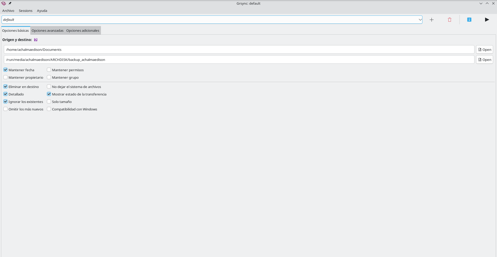

**¿Qué es rsync?**

**rsync** (remote sync) es una herramienta de sincronización de archivos y directorios que:

- **Sincroniza eficientemente:** Solo transfiere las diferencias entre archivos
- **Preserva metadatos:** Permisos, propietarios, timestamps, enlaces simbólicos
- **Funciona local y remotamente:** A través de SSH u otros protocolos
- **Es incremental:** Solo copia lo que ha cambiado
- **Permite recuperación:** Puede reanudar transferencias interrumpidas

## Ventajas de rsync

**Comparado con `cp`:**

- Solo copia archivos modificados
- Preserva todos los atributos
- Muestra progreso
- Puede excluir archivos/directorios
- Funciona sobre red

**Comparado con `scp`:**

- Mucho más rápido (solo diferencias)
- Puede reanudar transferencias
- Mejor manejo de errores
- Más opciones de filtrado

**Comparado con otras herramientas:**

- Más eficiente que tar para backups incrementales
- Más flexible que soluciones comerciales
- Multiplataforma (Linux, macOS, Windows)

## Casos de Uso Ideales

**Para ti como economista e informático:**

1. **Backup de Proyectos Quarto**
   - 10+ blogs académicos
   - Preservar estructura y metadatos
   - Backups incrementales diarios

2. **Sincronización de Scripts**
   - Scripts de automatización
   - Mantener versiones actualizadas
   - Entre diferentes máquinas

3. **Documentos de Investigación**
   - Papers y artículos
   - Datos de análisis
   - Referencias bibliográficas

4. **Configuraciones del Sistema**
   - Dotfiles (Fish, Quarto, etc.)
   - Configuraciones de aplicaciones
   - Recuperación rápida


# Instalación en Arch Linux

## Verificar Instalación

```bash
# rsync viene preinstalado en Arch Linux
rsync --version

# Salida esperada:
# rsync  version 3.2.7  protocol version 31
```

## Instalar si no está presente

```bash
sudo pacman -S rsync
```

## Instalar SSH (necesario para sincronización remota)

```bash
# Verificar SSH
ssh -V

# Instalar si falta
sudo pacman -S openssh
```

# Conceptos Fundamentales

## Algoritmo de rsync

rsync usa un algoritmo que:

1. **Divide archivos en bloques**
2. **Calcula checksums** de cada bloque
3. **Compara checksums** entre origen y destino
4. **Transfiere solo bloques diferentes**
5. **Reconstruye archivo** en destino

**Resultado:** Transferencias ultra-rápidas, especialmente con archivos grandes parcialmente modificados.

## Terminología

**Origen (Source):**

- El directorio/archivo a copiar
- Puede ser local o remoto

**Destino (Destination):**

- Donde se copiarán los archivos
- Puede ser local o remoto

**Trailing Slash (`/`):**

- **CON slash final:** `origen/` → copia CONTENIDO del directorio
- **SIN slash final:** `origen` → copia el DIRECTORIO mismo

```bash
# Ejemplo con slash:
rsync -av origen/ destino/
# Copia: origen/archivo1 → destino/archivo1

# Ejemplo sin slash:
rsync -av origen destino/
# Copia: origen/archivo1 → destino/origen/archivo1
```

**Esto es CRÍTICO y causa errores comunes.**


# Sintaxis Básica

## Estructura General

```bash
rsync [OPCIONES] ORIGEN DESTINO
```

## Ejemplos Básicos

```bash
# Local a local
rsync archivo.txt /ruta/destino/

# Local a remoto (SSH)
rsync archivo.txt usuario@servidor:/ruta/remota/

# Remoto a local (SSH)
rsync usuario@servidor:/ruta/remota/archivo.txt ./

# Directorio completo
rsync -av /ruta/origen/ /ruta/destino/
```

## Formato de Rutas Remotas

```bash
# SSH (por defecto, puerto 22)
usuario@host:/ruta/

# SSH con puerto específico
rsync -e "ssh -p 2222" archivo.txt usuario@host:/ruta/

# Rsync daemon (puerto 873)
rsync://host/modulo/ruta
```


# Opciones Esenciales

## Opciones Fundamentales

```bash
-a, --archive
    # Modo archivo: preserva casi todo
    # Equivale a: -rlptgoD
    # Recomendado para backups
    rsync -a origen/ destino/

-v, --verbose
    # Modo verboso: muestra archivos procesados
    rsync -av origen/ destino/

-h, --human-readable
    # Números legibles (KB, MB, GB)
    rsync -avh origen/ destino/

-z, --compress
    # Comprime durante transferencia (útil para red)
    rsync -avz origen/ usuario@servidor:/destino/

-P
    # Equivale a: --partial --progress
    # Muestra progreso y mantiene archivos parciales
    rsync -avP origen/ destino/

--progress
    # Muestra progreso de cada archivo
    rsync -av --progress origen/ destino/

-n, --dry-run
    # Prueba sin ejecutar (muy útil para verificar)
    rsync -avn origen/ destino/

-u, --update
    # Solo actualiza archivos más antiguos en destino
    rsync -avu origen/ destino/

--delete
    # Elimina archivos en destino que no existen en origen
    # ¡PELIGROSO! Usar con cuidado
    rsync -av --delete origen/ destino/

--delete-after
    # Elimina después de transferir (más seguro)
    rsync -av --delete-after origen/ destino/

-b, --backup
    # Crea backup de archivos que se sobrescriben
    rsync -avb origen/ destino/

--backup-dir=DIR
    # Guarda backups en directorio específico
    rsync -av --backup --backup-dir=../backups origen/ destino/
```

## Opciones de Preservación

```bash
-r, --recursive
    # Recursivo: incluye subdirectorios
    rsync -r origen/ destino/

-l, --links
    # Preserva enlaces simbólicos
    rsync -l origen/ destino/

-p, --perms
    # Preserva permisos
    rsync -p origen/ destino/

-t, --times
    # Preserva timestamps de modificación
    rsync -t origen/ destino/

-g, --group
    # Preserva grupo
    rsync -g origen/ destino/

-o, --owner
    # Preserva propietario (requiere root)
    rsync -o origen/ destino/

-D
    # Preserva dispositivos y archivos especiales
    # Equivale a: --devices --specials
    rsync -D origen/ destino/

-A, --acls
    # Preserva ACLs (listas de control de acceso)
    rsync -A origen/ destino/

-X, --xattrs
    # Preserva atributos extendidos
    rsync -X origen/ destino/

-H, --hard-links
    # Preserva enlaces duros
    rsync -H origen/ destino/
```

## Opciones de Exclusión

```bash
--exclude=PATRÓN
    # Excluir archivos/directorios
    rsync -av --exclude='*.tmp' origen/ destino/

--exclude-from=ARCHIVO
    # Excluir según archivo de patrones
    rsync -av --exclude-from=excludes.txt origen/ destino/

--include=PATRÓN
    # Incluir archivos (se procesa antes de exclude)
    rsync -av --include='*.pdf' --exclude='*' origen/ destino/

--filter=REGLA
    # Filtro avanzado
    rsync -av --filter='- *.tmp' origen/ destino/
```

## Opciones de Rendimiento

```bash
--partial
    # Mantiene archivos parcialmente transferidos
    rsync -av --partial origen/ destino/

--partial-dir=DIR
    # Guarda archivos parciales en directorio temporal
    rsync -av --partial-dir=.rsync-partial origen/ destino/

--timeout=SEGUNDOS
    # Timeout de I/O
    rsync -av --timeout=300 origen/ destino/

--bwlimit=KBPS
    # Limitar ancho de banda (KB/s)
    rsync -av --bwlimit=1000 origen/ destino/

--sparse
    # Optimiza archivos dispersos
    rsync -av --sparse origen/ destino/

--whole-file
    # Transferir archivos completos (útil en LAN rápida)
    rsync -av --whole-file origen/ destino/
```

# Modos de Operación

## 1. Copia Local

```bash
# Copiar directorio
rsync -av /origen/ /destino/

# Copiar archivo único
rsync -av archivo.txt /destino/

# Copiar múltiples archivos
rsync -av archivo1.txt archivo2.txt /destino/
```

## 2. Transferencia Remota vía SSH

```bash
# Local → Remoto
rsync -avz /origen/ usuario@servidor:/destino/

# Remoto → Local
rsync -avz usuario@servidor:/origen/ /destino/

# Con puerto SSH específico
rsync -avz -e "ssh -p 2222" /origen/ usuario@servidor:/destino/

# Con clave SSH específica
rsync -avz -e "ssh -i ~/.ssh/id_rsa_backup" /origen/ usuario@servidor:/destino/
```

## 3. Rsync Daemon

```bash
# Conectar a daemon rsync
rsync -av rsync://servidor/modulo/ruta /destino/

# Con autenticación
rsync -av usuario@rsync://servidor/modulo/ruta /destino/
```

## 4. Sincronización Bidireccional

```bash
# Sincronizar A → B
rsync -avu /ruta/A/ /ruta/B/

# Sincronizar B → A
rsync -avu /ruta/B/ /ruta/A/

# Nota: No es sincronización bidireccional simultánea
# Para eso usar herramientas como Unison o Syncthing
```

# Patrones de Inclusión y Exclusión

## Patrones Básicos

```bash
# Excluir extensión específica
rsync -av --exclude='*.tmp' origen/ destino/

# Excluir directorio
rsync -av --exclude='node_modules/' origen/ destino/

# Excluir múltiples patrones
rsync -av \
  --exclude='*.tmp' \
  --exclude='*.log' \
  --exclude='.git/' \
  origen/ destino/

# Incluir solo ciertos archivos
rsync -av \
  --include='*.pdf' \
  --include='*.docx' \
  --exclude='*' \
  origen/ destino/
```

## Archivo de Exclusiones

**Crear `excludes.txt`:**

```
# Comentarios comienzan con #
*.tmp
*.log
*.swp
*~
.git/
.gitignore
node_modules/
__pycache__/
*.pyc
.DS_Store
Thumbs.db
desktop.ini
```

**Usar archivo:**

```bash
rsync -av --exclude-from=excludes.txt origen/ destino/
```

## Patrones Avanzados

```bash
# Comodines
*        # Cualquier cosa
?        # Un carácter
**       # Cualquier cosa, incluyendo /
[abc]    # a, b o c
[0-9]    # Números

# Ejemplos:
--exclude='*.tmp'              # Todos los .tmp
--exclude='test_*.py'          # test_algo.py
--exclude='**/temp/'           # temp/ en cualquier nivel
--exclude='/cache/'            # Solo /cache/ en raíz
--exclude='*/cache/'           # cache/ en primer nivel
--exclude='**/.*'              # Archivos ocultos en cualquier lugar
```

## Filtros con --filter

```bash
# Sintaxis: --filter='REGLA PATRÓN'
# Reglas:
#   -  (exclude)
#   +  (include)
#   P  (protect - no eliminar)
#   R  (risk - se puede eliminar)
#   !  (clear - limpiar lista)

# Ejemplos:
rsync -av \
  --filter='- *.tmp' \
  --filter='+ *.pdf' \
  origen/ destino/

# Archivo de filtros
rsync -av --filter='. filter-rules.txt' origen/ destino/
```


# Sincronización Local

## Backup de Proyectos Quarto

```bash
# Backup de un blog específico
rsync -av \
  --exclude='_site/' \
  --exclude='.quarto/' \
  --exclude='*.log' \
  ~/Proyectos/epsilon-y-beta/ \
  /media/backup/blogs/epsilon-y-beta/

# Backup de todos los blogs
rsync -av \
  --exclude='_site/' \
  --exclude='.quarto/' \
  --exclude='*.log' \
  ~/Proyectos/ \
  /media/backup/Proyectos/

# Con verificación previa (dry-run)
rsync -avn \
  --exclude='_site/' \
  --exclude='.quarto/' \
  ~/Proyectos/epsilon-y-beta/ \
  /media/backup/blogs/epsilon-y-beta/
```

## Backup de Scripts

```bash
# Backup de scripts de automatización
rsync -av \
  --exclude='*.pyc' \
  --exclude='__pycache__/' \
  ~/Proyectos/scripts/ \
  /media/backup/scripts/

# Con compresión (aunque sea local, útil para discos lentos)
rsync -avz \
  ~/Proyectos/scripts/ \
  /media/usb/backups/scripts/
```

## Sincronizar Configuraciones

```bash
# Backup de configuraciones de Fish
rsync -av \
  ~/.config/fish/ \
  /media/backup/config/fish/

# Backup de dotfiles
rsync -av \
  --exclude='.git/' \
  ~/dotfiles/ \
  /media/backup/dotfiles/

# Backup selectivo de configuraciones
rsync -av \
  ~/.config/fish/config.fish \
  ~/.config/quarto/ \
  ~/.gitconfig \
  /media/backup/configs/
```

## Espejo de Directorio (Mirror)

```bash
# Crear espejo exacto (¡CUIDADO con --delete!)
rsync -av --delete origen/ destino/

# Espejo con backups de archivos eliminados
rsync -av --delete \
  --backup --backup-dir=../deleted_$(date +%Y%m%d) \
  origen/ destino/

# Espejo excluyendo ciertos archivos
rsync -av --delete \
  --exclude='*.tmp' \
  --exclude='.cache/' \
  origen/ destino/
```

# Sincronización Remota

## SSH: Configuración Básica

**1. Generar clave SSH (si no existe):**

```bash
# Generar clave
ssh-keygen -t ed25519 -C "backup-key"

# Copiar clave al servidor
ssh-copy-id usuario@servidor
```

**2. Configurar SSH (~/.ssh/config):**

```
Host backup-server
    HostName 192.168.1.100
    User achalmaedison
    Port 22
    IdentityFile ~/.ssh/id_ed25519
    Compression yes
```

**3. Usar alias en rsync:**

```bash
# En lugar de:
rsync -avz /origen/ usuario@192.168.1.100:/destino/

# Usar:
rsync -avz /origen/ backup-server:/destino/
```

## Backup a Servidor Remoto

```bash
# Backup básico
rsync -avz /home/achalmaedison/Proyectos/ \
  backup-server:/backups/Proyectos/

# Con exclusiones
rsync -avz \
  --exclude='_site/' \
  --exclude='node_modules/' \
  --exclude='*.log' \
  /home/achalmaedison/Proyectos/ \
  backup-server:/backups/Proyectos/

# Con progreso y parciales
rsync -avzP /home/achalmaedison/Documentos/ \
  backup-server:/backups/Documentos/

# Con límite de ancho de banda (1 MB/s)
rsync -avz --bwlimit=1000 \
  /home/achalmaedison/Videos/ \
  backup-server:/backups/Videos/
```

## Restaurar desde Servidor Remoto

```bash
# Restaurar todo
rsync -avz backup-server:/backups/Proyectos/ \
  /home/achalmaedison/Proyectos_restaurados/

# Restaurar archivo específico
rsync -avz \
  backup-server:/backups/Proyectos/epsilon-y-beta/index.qmd \
  ./

# Restaurar con verificación (dry-run primero)
rsync -avzn backup-server:/backups/ /restore/
rsync -avz backup-server:/backups/ /restore/
```

## Sincronización entre Servidores

```bash
# Desde servidor1 a servidor2
rsync -avz \
  usuario1@servidor1:/datos/ \
  usuario2@servidor2:/backup/

# Nota: la transferencia pasa por tu máquina local
# Para transferencia directa servidor-a-servidor, ejecutar rsync en uno de ellos
```

# Backup Incremental

## Concepto de Backup Incremental

**Backup completo:** Primera copia completa  
**Backup incremental:** Solo cambios desde el último backup  
**Ventaja:** Ahorra espacio y tiempo

## Método 1: Hard Links (Recomendado)

```bash
# Primer backup (completo)
rsync -av --delete \
  /origen/ \
  /backup/2026-01-25/

# Segundo backup (incremental con hard links)
rsync -av --delete \
  --link-dest=/backup/2026-01-25/ \
  /origen/ \
  /backup/2026-01-26/

# Tercer backup
rsync -av --delete \
  --link-dest=/backup/2026-01-26/ \
  /origen/ \
  /backup/2026-01-27/
```

**Ventajas:**

- Cada backup parece completo
- Archivos sin cambios son hard links (no duplican espacio)
- Archivos modificados se copian completamente
- Fácil restauración: elegir fecha y copiar

**Estructura resultante:**

```
/backup/
├── 2026-01-25/  (backup completo)
├── 2026-01-26/  (solo cambios, resto hard links)
└── 2026-01-27/  (solo cambios, resto hard links)
```

## Método 2: Directorio de Backup

```bash
# Backup con directorio para sobrescritos
rsync -av --delete \
  --backup --backup-dir=../incrementales/$(date +%Y%m%d_%H%M%S) \
  /origen/ \
  /backup/actual/
```

**Ventajas:**

- Siempre hay un backup "actual" completo
- Archivos sobrescritos se guardan en carpetas con fecha
- Fácil ver qué cambió cada día

## Método 3: Snapshots con Timestamp

```bash
# Script de backup incremental
#!/bin/bash

FECHA=$(date +%Y%m%d_%H%M%S)
ORIGEN="/home/achalmaedison/Proyectos"
BACKUP_DIR="/media/backup/Proyectos"
ULTIMO=$(ls -1 "$BACKUP_DIR" | tail -n 1)

# Crear nuevo backup
rsync -av --delete \
  --link-dest="$BACKUP_DIR/$ULTIMO" \
  "$ORIGEN/" \
  "$BACKUP_DIR/$FECHA/"

# Crear enlace simbólico "latest"
ln -snf "$FECHA" "$BACKUP_DIR/latest"
```

# Casos de Uso Profesionales

## Caso 1: Backup Diario de Blogs Quarto

**Escenario:** Backup automático de 10+ blogs académicos.

```bash
#!/bin/bash
# backup-blogs.sh

FECHA=$(date +%Y%m%d)
ORIGEN="/home/achalmaedison/Proyectos"
DESTINO="/media/backup/blogs"

# Lista de blogs
BLOGS=(
    "epsilon-y-beta"
    "axiomata"
    "methodica"
    "aequilibria"
    "optimums"
    "pecunia-fluxus"
    "actus-mercator"
    "res-publica"
    "dialectica-y-mercado"
    "numerus-scriptum"
    "chaska"
)

echo "=== Backup de Blogs - $FECHA ==="

for blog in "${BLOGS[@]}"; do
    echo "Respaldando: $blog"

    rsync -av --delete \
        --exclude='_site/' \
        --exclude='.quarto/' \
        --exclude='*.log' \
        --exclude='.Rproj.user/' \
        --exclude='*.Rproj' \
        "$ORIGEN/$blog/" \
        "$DESTINO/$blog/" \
        >> "/var/log/backup-blogs-$FECHA.log" 2>&1

    if [ $? -eq 0 ]; then
        echo "  ✓ Completado"
    else
        echo "  ✗ Error"
    fi
done

echo "=== Backup Completado ==="
```

## Caso 2: Sincronización de Scripts entre Máquinas

**Escenario:** Mantener scripts actualizados en laptop y desktop.

```bash
#!/bin/bash
# sync-scripts.sh

HOST=$(hostname)
SCRIPTS_DIR="/home/achalmaedison/Proyectos/scripts"

if [ "$HOST" = "laptop" ]; then
    # Laptop → Desktop
    echo "Sincronizando desde laptop a desktop..."
    rsync -avzu \
        --exclude='__pycache__/' \
        --exclude='*.pyc' \
        --exclude='.git/' \
        "$SCRIPTS_DIR/" \
        desktop:/home/achalmaedison/Proyectos/scripts/

elif [ "$HOST" = "desktop" ]; then
    # Desktop → Laptop
    echo "Sincronizando desde desktop a laptop..."
    rsync -avzu \
        --exclude='__pycache__/' \
        --exclude='*.pyc' \
        --exclude='.git/' \
        "$SCRIPTS_DIR/" \
        laptop:/home/achalmaedison/Proyectos/scripts/
fi
```

## Caso 3: Backup Incremental Semanal

**Escenario:** Backup semanal con retención de 4 semanas.

```bash
#!/bin/bash
# backup-semanal.sh

SEMANA=$(date +%Y_W%U)
ORIGEN="/home/achalmaedison"
BACKUP_BASE="/media/backup/semanal"
BACKUP_DIR="$BACKUP_BASE/$SEMANA"
ULTIMO=$(ls -1t "$BACKUP_BASE" | head -n 1)

echo "=== Backup Semanal - Semana $SEMANA ==="

# Crear backup incremental
if [ -d "$BACKUP_BASE/$ULTIMO" ]; then
    rsync -av --delete \
        --link-dest="$BACKUP_BASE/$ULTIMO" \
        --exclude-from="$HOME/.rsync-exclude" \
        "$ORIGEN/" \
        "$BACKUP_DIR/"
else
    # Primer backup (completo)
    rsync -av --delete \
        --exclude-from="$HOME/.rsync-exclude" \
        "$ORIGEN/" \
        "$BACKUP_DIR/"
fi

# Enlace simbólico al último
ln -snf "$SEMANA" "$BACKUP_BASE/latest"

# Eliminar backups antiguos (más de 4 semanas)
cd "$BACKUP_BASE"
ls -1t | tail -n +5 | xargs -I {} rm -rf {}

echo "Backup completado en: $BACKUP_DIR"
```

**Archivo `~/.rsync-exclude`:**

```
# Cachés y temporales
.cache/
.thumbnails/
*.tmp
*.temp
*~

# Compilados
*.pyc
__pycache__/
*.o
*.so

# IDEs
.vscode/
.idea/

# Quarto
_site/
.quarto/

# Git
.git/

# Logs
*.log

# Grandes
*.iso
*.img
```

## Caso 4: Backup a Servidor Remoto Cifrado

**Escenario:** Backup cifrado de documentos sensibles.

```bash
#!/bin/bash
# backup-cifrado.sh

FECHA=$(date +%Y%m%d_%H%M%S)
ORIGEN="/home/achalmaedison/Documentos/Sensibles"
DESTINO="backup-server:/backups/cifrados"
TEMP="/tmp/backup-$FECHA"
ARCHIVO="backup-$FECHA.tar.gz.gpg"

echo "=== Backup Cifrado - $FECHA ==="

# 1. Sincronizar a temporal
rsync -av "$ORIGEN/" "$TEMP/"

# 2. Comprimir
tar -czf "$TEMP.tar.gz" -C "$(dirname $TEMP)" "$(basename $TEMP)"

# 3. Cifrar
gpg --encrypt --recipient backup@example.com "$TEMP.tar.gz"

# 4. Transferir
rsync -av --progress "$TEMP.tar.gz.gpg" "$DESTINO/$ARCHIVO"

# 5. Limpiar
rm -rf "$TEMP" "$TEMP.tar.gz" "$TEMP.tar.gz.gpg"

echo "Backup cifrado completado: $ARCHIVO"
```

## Caso 5: Sincronización Bidireccional Cuidadosa

**Escenario:** Sincronizar cambios entre dos ubicaciones sin pérdida.

```bash
#!/bin/bash
# sync-bidireccional.sh

RUTA_A="/home/achalmaedison/Proyectos/epsilon-y-beta"
RUTA_B="/media/usb/epsilon-y-beta"

echo "=== Sincronización Bidireccional ==="

# A → B (solo archivos más nuevos)
echo "Sincronizando A → B..."
rsync -avu --progress "$RUTA_A/" "$RUTA_B/"

# B → A (solo archivos más nuevos)
echo "Sincronizando B → A..."
rsync -avu --progress "$RUTA_B/" "$RUTA_A/"

echo "Sincronización completada"
```

**Nota:** Para sincronización bidireccional real con detección de conflictos, usar `Unison` o `Syncthing`.

## Caso 6: Backup de Base de Datos con rsync

**Escenario:** Backup de bases de datos SQLite.

```bash
#!/bin/bash
# backup-databases.sh

FECHA=$(date +%Y%m%d_%H%M%S)
DB_DIR="/home/achalmaedison/databases"
BACKUP_DIR="/media/backup/databases"
TEMP_DIR="/tmp/db-backup-$FECHA"

mkdir -p "$TEMP_DIR"

echo "=== Backup de Bases de Datos ==="

# Copiar y comprimir bases de datos
for db in "$DB_DIR"/*.db; do
    nombre=$(basename "$db")
    echo "Procesando: $nombre"

    # Checkpoint WAL (si existe)
    sqlite3 "$db" "PRAGMA wal_checkpoint(FULL);"

    # Copiar
    cp "$db" "$TEMP_DIR/$nombre"

    # Comprimir
    gzip "$TEMP_DIR/$nombre"
done

# Sincronizar al backup
rsync -av --delete \
    "$TEMP_DIR/" \
    "$BACKUP_DIR/$FECHA/"

# Enlace al último
ln -snf "$FECHA" "$BACKUP_DIR/latest"

# Limpiar temporal
rm -rf "$TEMP_DIR"

# Eliminar backups antiguos (más de 30 días)
find "$BACKUP_DIR" -maxdepth 1 -type d -mtime +30 -exec rm -rf {} \;

echo "Backup completado"
```

## Caso 7: Replicación de Configuraciones

**Escenario:** Replicar dotfiles y configuraciones entre máquinas.

```bash
#!/bin/bash
# replicate-configs.sh

USUARIO="achalmaedison"
CONFIGS=(
    ".config/fish"
    ".config/nvim"
    ".config/quarto"
    ".gitconfig"
    ".ssh/config"
)

DESTINO="$1"

if [ -z "$DESTINO" ]; then
    echo "Uso: $0 <usuario@host>"
    exit 1
fi

echo "=== Replicando Configuraciones ==="

for config in "${CONFIGS[@]}"; do
    echo "Replicando: $config"

    if [ -f "$HOME/$config" ]; then
        # Es un archivo
        rsync -av "$HOME/$config" "$DESTINO:~/$config"
    elif [ -d "$HOME/$config" ]; then
        # Es un directorio
        rsync -av "$HOME/$config/" "$DESTINO:~/$config/"
    fi
done

echo "Replicación completada"
```

# Automatización con Systemd

## Timer de Systemd para Backups Automáticos

### 1. Crear Script de Backup

**`/usr/local/bin/backup-proyectos.sh`:**

```bash
#!/bin/bash

FECHA=$(date +%Y%m%d_%H%M%S)
LOG="/var/log/backup-proyectos.log"

{
    echo "=== Backup - $FECHA ==="

    rsync -av --delete \
        --exclude='_site/' \
        --exclude='.quarto/' \
        /home/achalmaedison/Proyectos/ \
        /media/backup/Proyectos/

    if [ $? -eq 0 ]; then
        echo "Backup completado exitosamente"
    else
        echo "Error en backup"
    fi

    echo ""
} >> "$LOG" 2>&1
```

```bash
sudo chmod +x /usr/local/bin/backup-proyectos.sh
```

### 2. Crear Servicio Systemd

**`/etc/systemd/system/backup-proyectos.service`:**

```ini
[Unit]
Description=Backup de Proyectos Quarto
After=network.target

[Service]
Type=oneshot
User=achalmaedison
ExecStart=/usr/local/bin/backup-proyectos.sh
```

### 3. Crear Timer

**`/etc/systemd/system/backup-proyectos.timer`:**

```ini
[Unit]
Description=Timer para Backup de Proyectos
Requires=backup-proyectos.service

[Timer]
# Ejecutar diariamente a las 2 AM
OnCalendar=daily
OnCalendar=02:00
Persistent=true

[Install]
WantedBy=timers.target
```

### 4. Habilitar y Activar

```bash
# Recargar systemd
sudo systemctl daemon-reload

# Habilitar timer
sudo systemctl enable backup-proyectos.timer

# Iniciar timer
sudo systemctl start backup-proyectos.timer

# Verificar estado
systemctl status backup-proyectos.timer

# Ver próxima ejecución
systemctl list-timers backup-proyectos.timer

# Ejecutar manualmente (probar)
sudo systemctl start backup-proyectos.service

# Ver logs
journalctl -u backup-proyectos.service
```

## Múltiples Timers

**Backup semanal completo:**

```ini
# /etc/systemd/system/backup-semanal.timer
[Unit]
Description=Backup Semanal Completo

[Timer]
# Cada domingo a las 3 AM
OnCalendar=Sun 03:00
Persistent=true

[Install]
WantedBy=timers.target
```

**Backup mensual:**

```ini
# /etc/systemd/system/backup-mensual.timer
[Unit]
Description=Backup Mensual

[Timer]
# Primer día del mes a las 4 AM
OnCalendar=monthly
OnCalendar=04:00
Persistent=true

[Install]
WantedBy=timers.target
```

# Troubleshooting

## Problema 1: "Permission denied"

**Causa:** Falta de permisos en origen o destino.

**Soluciones:**

```bash
# Verificar permisos de origen
ls -la /ruta/origen/

# Verificar permisos de destino
ls -la /ruta/destino/

# Si es problema de propietario, cambiar
sudo chown -R $USER:$USER /ruta/destino/

# O usar sudo con rsync (no recomendado)
sudo rsync -av /origen/ /destino/

# Para remoto, verificar permisos SSH
ssh usuario@servidor ls -la /ruta/destino/
```

## Problema 2: Archivos no se actualizan

**Causa:** Timestamps o opciones incorrectas.

**Soluciones:**

```bash
# Verificar si archivos son realmente diferentes
diff archivo_origen archivo_destino

# Forzar actualización ignorando timestamps
rsync -av --ignore-times /origen/ /destino/

# Usar checksums (más lento pero seguro)
rsync -avc /origen/ /destino/

# Actualizar solo si origen es más nuevo
rsync -avu /origen/ /destino/
```

## Problema 3: "rsync: connection unexpectedly closed"

**Causa:** Conexión SSH interrumpida o timeout.

**Soluciones:**

```bash
# Aumentar timeout
rsync -av --timeout=600 /origen/ usuario@servidor:/destino/

# Usar compresión (reduce tiempo de transferencia)
rsync -avz /origen/ usuario@servidor:/destino/

# Usar partial (mantiene archivos parciales)
rsync -avP /origen/ usuario@servidor:/destino/

# Configurar SSH keepalive (~/.ssh/config)
Host *
    ServerAliveInterval 60
    ServerAliveCountMax 3
```

## Problema 4: Espacio insuficiente en destino

**Causa:** Destino lleno o archivos muy grandes.

**Soluciones:**

```bash
# Verificar espacio disponible
df -h /destino/

# Usar --delete-after en lugar de --delete (usa menos espacio temporal)
rsync -av --delete-after /origen/ /destino/

# Excluir archivos grandes
rsync -av --max-size=100M /origen/ /destino/

# Limpiar backups antiguos primero
find /destino/backups/ -mtime +30 -delete

# Usar compresión
rsync -avz /origen/ /destino/
```

## Problema 5: Transferencia muy lenta

**Causa:** Red lenta, archivos grandes, falta de compresión.

**Soluciones:**

```bash
# Habilitar compresión
rsync -avz /origen/ usuario@servidor:/destino/

# Usar --whole-file en LAN rápida
rsync -av --whole-file /origen/ /destino/

# Limitar archivos procesados
rsync -av --max-size=10M /origen/ /destino/

# Limitar ancho de banda (útil para no saturar red)
rsync -av --bwlimit=1000 /origen/ /destino/

# Usar opciones de rendimiento SSH
rsync -av -e "ssh -c aes128-gcm@openssh.com" \
    /origen/ usuario@servidor:/destino/
```

## Problema 6: "some files/attrs were not transferred"

**Causa:** Permisos especiales, ACLs, xattrs.

**Soluciones:**

```bash
# Ver qué archivos fallaron
rsync -av --itemize-changes /origen/ /destino/ 2>&1 | grep -i error

# Ignorar errores de permisos (útil para copias entre sistemas)
rsync -av --no-perms --no-owner --no-group /origen/ /destino/

# Preservar solo lo esencial
rsync -rltv /origen/ /destino/

# Ejecutar con sudo (si necesario)
sudo rsync -av /origen/ /destino/
```

## Problema 7: Trailing slash causa estructura incorrecta

**Problema común:** Olvidar o agregar `/` incorrectamente.

```bash
# INCORRECTO (crea origen/ dentro de destino/)
rsync -av origen destino/
# Resultado: destino/origen/archivos

# CORRECTO (copia contenido de origen/ a destino/)
rsync -av origen/ destino/
# Resultado: destino/archivos

# Regla mnemotécnica:
# origen/  → "dame el CONTENIDO"
# origen   → "dame el DIRECTORIO"
```

## Problema 8: --delete elimina archivos importantes

**Prevención y recuperación:**

```bash
# SIEMPRE usar --dry-run primero
rsync -avn --delete origen/ destino/

# Usar --backup con --delete
rsync -av --delete \
    --backup --backup-dir=../deleted_$(date +%Y%m%d) \
    origen/ destino/

# Usar --delete-after (más seguro)
rsync -av --delete-after origen/ destino/

# Restaurar archivos eliminados accidentalmente
cp ../deleted_20260125/archivo.txt destino/
```


# Scripts de Backup

## Script Fish: Backup Inteligente de Proyectos

**`~/.config/fish/functions/backup-proyecto.fish`:**

```fish
function backup-proyecto --description "Backup inteligente de proyectos Quarto"
    set -l proyecto $argv[1]
    set -l destino $argv[2]

    if test (count $argv) -lt 2
        echo "Uso: backup-proyecto <proyecto> <destino>"
        echo ""
        echo "Ejemplo:"
        echo "  backup-proyecto epsilon-y-beta /media/backup/blogs/"
        return 1
    end

    set -l origen "$HOME/Proyectos/$proyecto"

    # Verificar que el proyecto existe
    if not test -d "$origen"
        echo "Error: Proyecto no encontrado: $origen"
        return 1
    end

    # Crear destino si no existe
    mkdir -p "$destino"

    echo "=== Backup de $proyecto ==="
    echo "Origen: $origen"
    echo "Destino: $destino"
    echo ""

    # Ejecutar rsync
    rsync -av --delete \
        --exclude='_site/' \
        --exclude='.quarto/' \
        --exclude='*.log' \
        --exclude='.Rproj.user/' \
        --progress \
        "$origen/" \
        "$destino/$proyecto/"

    if test $status -eq 0
        echo ""
        echo "✓ Backup completado exitosamente"
    else
        echo ""
        echo "✗ Error en backup"
        return 1
    end
end
```

**Usar:**

```fish
backup-proyecto epsilon-y-beta /media/backup/blogs/
backup-proyecto scripts /media/usb/backups/
```

## Script Bash: Backup Completo con Rotación

**`~/bin/backup-completo.sh`:**

```bash
#!/bin/bash
# backup-completo.sh - Backup completo con rotación de versiones

set -e

# Configuración
ORIGEN="/home/achalmaedison/Proyectos"
BACKUP_BASE="/media/backup/Proyectos"
RETENER=7  # días
LOG="/var/log/backup-completo.log"

# Fecha actual
FECHA=$(date +%Y%m%d_%H%M%S)
DIA=$(date +%A)

# Directorio de backup
BACKUP_DIR="$BACKUP_BASE/$FECHA"
ULTIMO=$(ls -1t "$BACKUP_BASE" 2>/dev/null | head -n 1)

# Función de log
log() {
    echo "[$(date '+%Y-%m-%d %H:%M:%S')] $*" | tee -a "$LOG"
}

# Inicio
log "=== Inicio de Backup Completo ==="
log "Origen: $ORIGEN"
log "Destino: $BACKUP_DIR"

# Crear directorio de backup
mkdir -p "$BACKUP_DIR"

# Ejecutar rsync con hard links si existe backup anterior
if [ -d "$BACKUP_BASE/$ULTIMO" ]; then
    log "Backup incremental usando: $ULTIMO"

    rsync -av --delete \
        --link-dest="$BACKUP_BASE/$ULTIMO" \
        --exclude-from="$HOME/.rsync-exclude-proyectos" \
        "$ORIGEN/" \
        "$BACKUP_DIR/" \
        2>&1 | tee -a "$LOG"
else
    log "Primer backup (completo)"

    rsync -av --delete \
        --exclude-from="$HOME/.rsync-exclude-proyectos" \
        "$ORIGEN/" \
        "$BACKUP_DIR/" \
        2>&1 | tee -a "$LOG"
fi

# Verificar éxito
if [ ${PIPESTATUS[0]} -eq 0 ]; then
    log "✓ Backup completado exitosamente"

    # Crear enlace simbólico al último
    ln -snf "$FECHA" "$BACKUP_BASE/latest"
    ln -snf "$FECHA" "$BACKUP_BASE/$DIA"

    # Estadísticas
    TAMANO=$(du -sh "$BACKUP_DIR" | cut -f1)
    log "Tamaño del backup: $TAMANO"

    # Rotación: eliminar backups antiguos
    log "Eliminando backups antiguos (>$RETENER días)..."
    find "$BACKUP_BASE" -maxdepth 1 -type d -mtime +$RETENER \
        ! -name "$(basename $BACKUP_BASE)" \
        -exec rm -rf {} \; 2>&1 | tee -a "$LOG"

    log "Backups actuales:"
    ls -lt "$BACKUP_BASE" | grep ^d | tee -a "$LOG"

else
    log "✗ Error en backup"
    exit 1
fi

log "=== Fin de Backup ==="
echo ""
```

**Archivo `~/.rsync-exclude-proyectos`:**

```
# Quarto
_site/
.quarto/
*.Rproj
.Rproj.user/

# Python
__pycache__/
*.pyc
*.pyo
.venv/
venv/

# Node
node_modules/
package-lock.json

# Logs
*.log

# Temporales
*.tmp
*.temp
*~
.DS_Store
```

**Hacer ejecutable:**

```bash
chmod +x ~/bin/backup-completo.sh
```

## Script: Verificación de Backups

**`~/bin/verificar-backup.sh`:**

```bash
#!/bin/bash
# verificar-backup.sh - Verificar integridad de backups

ORIGEN="/home/achalmaedison/Proyectos"
BACKUP_DIR="/media/backup/Proyectos/latest"

echo "=== Verificación de Backup ==="
echo "Comparando: $ORIGEN ↔ $BACKUP_DIR"
echo ""

# Comparar con checksums
rsync -avcn --delete \
    --exclude-from="$HOME/.rsync-exclude-proyectos" \
    "$ORIGEN/" \
    "$BACKUP_DIR/" \
    | tee verificacion.log

# Analizar resultados
if grep -q "deleting\|sending\|receiving" verificacion.log; then
    echo ""
    echo "⚠ ATENCIÓN: Hay diferencias entre origen y backup"
    echo "Ver detalles en: verificacion.log"
else
    echo ""
    echo "✓ Backup verificado: origen y backup idénticos"
fi
```

# Mejores Prácticas

## Seguridad

1. **Nunca usar rsync como root innecesariamente**

   ```bash
   # Mal
   sudo rsync -av /origen/ /destino/

   # Bien (ajustar permisos primero)
   sudo chown -R $USER:$USER /destino/
   rsync -av /origen/ /destino/
   ```

2. **Usar SSH keys en lugar de contraseñas**

   ```bash
   ssh-keygen -t ed25519
   ssh-copy-id usuario@servidor
   ```

3. **Cifrar backups sensibles**

   ```bash
   rsync + tar + gpg
   # Ver Caso 4 en sección anterior
   ```

4. **Restringir permisos de scripts**
   ```bash
   chmod 700 ~/bin/backup-scripts.sh
   ```

## Rendimiento

1. **Usar compresión solo cuando sea necesario**

   ```bash
   # Red lenta: SÍ
   rsync -avz /origen/ remoto:/destino/

   # LAN rápida: NO
   rsync -av /origen/ /destino/
   ```

2. **Aprovechar --link-dest para backups incrementales**

   ```bash
   # Ahorra espacio sin sacrificar acceso
   rsync -av --link-dest=/backup/anterior/ \
       /origen/ /backup/nuevo/
   ```

3. **Excluir lo innecesario**

   ```bash
   --exclude='_site/'
   --exclude='node_modules/'
   --exclude='*.log'
   ```

4. **Usar --partial para transferencias grandes**
   ```bash
   rsync -avP /grande/ remoto:/destino/
   ```

## Confiabilidad

1. **SIEMPRE usar --dry-run primero**

   ```bash
   rsync -avn --delete /origen/ /destino/
   # Revisar salida
   rsync -av --delete /origen/ /destino/
   ```

2. **Hacer backups de backups críticos**

   ```bash
   # Backup → Disco externo → Servidor remoto
   ```

3. **Verificar backups periódicamente**

   ```bash
   rsync -avcn /origen/ /backup/
   ```

4. **Mantener logs**

   ```bash
   rsync -av /origen/ /destino/ >> backup.log 2>&1
   ```

5. **Probar restauraciones**
   ```bash
   # Regularmente, restaurar archivos de prueba
   rsync -av /backup/test/ /tmp/restore-test/
   ```

## Organización

1. **Estructura de directorios clara**

   ```
   /media/backup/
   ├── diario/
   │   ├── 2026-01-25/
   │   ├── 2026-01-26/
   │   └── latest -> 2026-01-26
   ├── semanal/
   │   ├── 2026_W04/
   │   └── latest -> 2026_W04
   └── mensual/
       ├── 2026-01/
       └── latest -> 2026-01
   ```

2. **Nombrar backups con timestamp**

   ```bash
   FECHA=$(date +%Y%m%d_%H%M%S)
   /backup/$FECHA/
   ```

3. **Mantener README en backups**
   ```bash
   cat > /backup/README.txt << EOF
   Backup de: Proyectos Quarto
   Fecha: $(date)
   Origen: /home/achalmaedison/Proyectos
   Script: ~/bin/backup-proyectos.sh
   EOF
   ```


# Referencia Rápida

## Comandos Esenciales

```bash
# BÁSICO
rsync -av origen/ destino/             # Básico con archivo
rsync -avh origen/ destino/            # Con tamaños legibles
rsync -avP origen/ destino/            # Con progreso

# EXCLUSIÓN
rsync -av --exclude='*.tmp' origen/ destino/
rsync -av --exclude-from=excludes.txt origen/ destino/

# ELIMINACIÓN
rsync -av --delete origen/ destino/            # Espejo exacto
rsync -av --delete-after origen/ destino/      # Más seguro

# BACKUP INCREMENTAL
rsync -av --link-dest=/backup/anterior/ \
    origen/ /backup/nuevo/

# REMOTO
rsync -avz origen/ usuario@servidor:/destino/  # SSH
rsync -avz usuario@servidor:/origen/ destino/  # Desde remoto

# VERIFICACIÓN
rsync -avcn origen/ destino/           # Dry-run con checksum

# RECUPERACIÓN
rsync -av --partial origen/ destino/   # Reanudar interrumpida
```

## Opciones Más Usadas

```
-a  --archive        # Modo archivo (recomendado)
-v  --verbose        # Verboso
-h  --human-readable # Tamaños legibles
-z  --compress       # Comprimir durante transferencia
-P                   # --partial --progress
-n  --dry-run        # Simular (no ejecutar)
-u  --update         # Solo si más nuevo
-r  --recursive      # Recursivo
-l  --links          # Copiar symlinks
-p  --perms          # Preservar permisos
-t  --times          # Preservar timestamps
-g  --group          # Preservar grupo
-o  --owner          # Preservar dueño
-D                   # --devices --specials

--delete             # Eliminar extras en destino
--exclude=PATRÓN     # Excluir archivos
--include=PATRÓN     # Incluir archivos
--link-dest=DIR      # Hard links para incrementales
--backup             # Backup de sobrescritos
--backup-dir=DIR     # Donde guardar backups
--bwlimit=KBPS       # Limitar ancho de banda
--timeout=SEGUNDOS   # Timeout de I/O
```

## Patrones de Exclusión Comunes

```
*.tmp
*.log
*.swp
*~
.git/
.svn/
.DS_Store
Thumbs.db
__pycache__/
*.pyc
node_modules/
_site/
.quarto/
```

## Trailing Slash: Regla de Oro

```bash
# CON slash (/) = CONTENIDO
rsync -av origen/ destino/
# Copia: origen/archivo → destino/archivo

# SIN slash = DIRECTORIO
rsync -av origen destino/
# Copia: origen/archivo → destino/origen/archivo
```

## Estructura de Backup Recomendada

```
/media/backup/
├── Proyectos/
│   ├── 20260125_120000/
│   ├── 20260126_120000/
│   └── latest -> 20260126_120000
├── Documentos/
│   └── latest/
└── Config/
    └── latest/
```

## Alias Fish Útiles

```fish
# ~/.config/fish/config.fish

# Básicos
alias rsync-backup="rsync -avh --progress"
alias rsync-mirror="rsync -avh --delete --progress"
alias rsync-test="rsync -avhn"

# Backups específicos
alias backup-proyectos="rsync -av --exclude='_site/' --exclude='.quarto/' ~/Proyectos/ /media/backup/Proyectos/"
alias backup-docs="rsync -av ~/Documentos/ /media/backup/Documentos/"
alias backup-config="rsync -av ~/.config/ /media/backup/config/"

# Remotos
alias rsync-upload="rsync -avz --progress"
alias rsync-download="rsync -avz --progress"
```

# Recursos Adicionales

## Documentación Oficial

- **Man page:** `man rsync`
- **Sitio oficial:** https://rsync.samba.org/
- **Documentación:** https://rsync.samba.org/documentation.html

## Herramientas Complementarias

```bash
# En Arch Linux
sudo pacman -S rsync rclone unison

# Otras utilidades
yay -S grsync  # GUI para rsync
```

## Alternativas y Complementos

- **rclone:** rsync para servicios cloud (Google Drive, Dropbox, etc.)
- **Unison:** Sincronización bidireccional real
- **Syncthing:** Sincronización continua P2P
- **Borg:** Backups incrementales con deduplicación
- **Restic:** Backups cifrados con snapshots


# Publicaciones Similares

Si te interesó este artículo, te recomendamos que explores otros blogs y recursos relacionados que pueden ampliar tus conocimientos. Aquí te dejo algunas sugerencias:


1. [](https://chaska-x.netlify.app/operating-system/2017-05-21-comandos-de-informacion-windows/index.pdf) [Comandos De Informacion Windows](https://chaska-x.netlify.app/operating-system/2017-05-21-comandos-de-informacion-windows)
2. [](https://chaska-x.netlify.app/operating-system/2019-06-19-adb/index.pdf) [Adb](https://chaska-x.netlify.app/operating-system/2019-06-19-adb)
3. [](https://chaska-x.netlify.app/operating-system/2021-08-17-limpieza-y-optimizacion-de-pc/index.pdf) [Limpieza Y Optimizacion De Pc](https://chaska-x.netlify.app/operating-system/2021-08-17-limpieza-y-optimizacion-de-pc)
4. [](https://chaska-x.netlify.app/operating-system/2021-10-21-scrcpy/index.pdf) [Scrcpy](https://chaska-x.netlify.app/operating-system/2021-10-21-scrcpy)
5. [](https://chaska-x.netlify.app/operating-system/2022-05-12-gestionar-versiones-de-jdk-en-kubuntu/index.pdf) [Gestionar Versiones De Jdk En Kubuntu](https://chaska-x.netlify.app/operating-system/2022-05-12-gestionar-versiones-de-jdk-en-kubuntu)
6. [](https://chaska-x.netlify.app/operating-system/2022-07-21-instalar-tor-browser/index.pdf) [Instalar Tor Browser](https://chaska-x.netlify.app/operating-system/2022-07-21-instalar-tor-browser)
7. [](https://chaska-x.netlify.app/operating-system/2022-08-14-crear-enlaces-duros-o-hard-link-en-linux/index.pdf) [Crear Enlaces Duros O Hard Link En Linux](https://chaska-x.netlify.app/operating-system/2022-08-14-crear-enlaces-duros-o-hard-link-en-linux)
8. [](https://chaska-x.netlify.app/operating-system/2022-09-27-comandos-vim/index.pdf) [Comandos Vim](https://chaska-x.netlify.app/operating-system/2022-09-27-comandos-vim)
9. [](https://chaska-x.netlify.app/operating-system/2023-02-16-guia-de-git-y-github/index.pdf) [Guia De Git Y Github](https://chaska-x.netlify.app/operating-system/2023-02-16-guia-de-git-y-github)
10. [](https://chaska-x.netlify.app/operating-system/2023-05-02-00-primeros-pasos-en-linux/index.pdf) [00 Primeros Pasos En Linux](https://chaska-x.netlify.app/operating-system/2023-05-02-00-primeros-pasos-en-linux)
11. [](https://chaska-x.netlify.app/operating-system/2023-06-17-01-introduccion-linux/index.pdf) [01 Introduccion Linux](https://chaska-x.netlify.app/operating-system/2023-06-17-01-introduccion-linux)
12. [](https://chaska-x.netlify.app/operating-system/2023-06-18-02-distribuciones-linux/index.pdf) [02 Distribuciones Linux](https://chaska-x.netlify.app/operating-system/2023-06-18-02-distribuciones-linux)
13. [](https://chaska-x.netlify.app/operating-system/2023-06-19-03-instalacion-linux/index.pdf) [03 Instalacion Linux](https://chaska-x.netlify.app/operating-system/2023-06-19-03-instalacion-linux)
14. [](https://chaska-x.netlify.app/operating-system/2023-06-20-04-administracion-particiones-volumenes/index.pdf) [04 Administracion Particiones Volumenes](https://chaska-x.netlify.app/operating-system/2023-06-20-04-administracion-particiones-volumenes)
15. [](https://chaska-x.netlify.app/operating-system/2023-07-01-atajos-de-teclado-y-comandos-para-usar-vim/index.pdf) [Atajos De Teclado Y Comandos Para Usar Vim](https://chaska-x.netlify.app/operating-system/2023-07-01-atajos-de-teclado-y-comandos-para-usar-vim)
16. [](https://chaska-x.netlify.app/operating-system/2024-07-15-instalando-specitify/index.pdf) [Instalando Specitify](https://chaska-x.netlify.app/operating-system/2024-07-15-instalando-specitify)
17. [](https://chaska-x.netlify.app/operating-system/2025-07-10-gestiona-tus-dotfiles-con-gnu-stow/index.pdf) [Gestiona Tus Dotfiles Con Gnu Stow](https://chaska-x.netlify.app/operating-system/2025-07-10-gestiona-tus-dotfiles-con-gnu-stow)
18. [](https://chaska-x.netlify.app/operating-system/2025-12-30-guia-de-ranger/index.pdf) [Guia De Ranger](https://chaska-x.netlify.app/operating-system/2025-12-30-guia-de-ranger)
19. [](https://chaska-x.netlify.app/operating-system/2025-12-31-guia-de-kitty-terminal/index.pdf) [Guia De Kitty Terminal](https://chaska-x.netlify.app/operating-system/2025-12-31-guia-de-kitty-terminal)
20. [](https://chaska-x.netlify.app/operating-system/2025-12-31-guia-de-positron-ide/index.pdf) [Guia De Positron Ide](https://chaska-x.netlify.app/operating-system/2025-12-31-guia-de-positron-ide)
21. [](https://chaska-x.netlify.app/operating-system/2026-04-23-guia-de-rsync/index.pdf) [Guia De Rsync](https://chaska-x.netlify.app/operating-system/2026-04-23-guia-de-rsync)


Esperamos que encuentres estas publicaciones igualmente interesantes y útiles. ¡Disfruta de la lectura!

